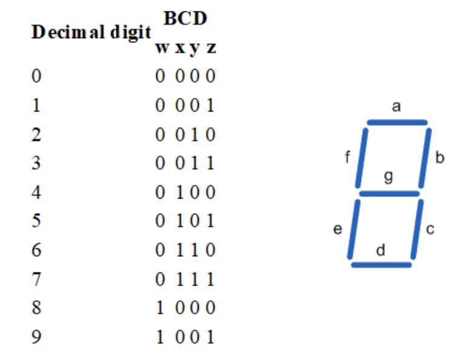
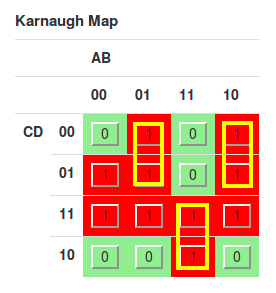
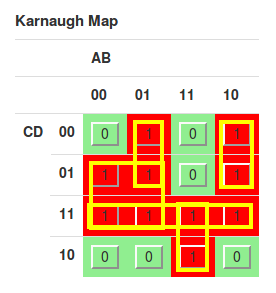

# Foundation of Computer Engineering

## Lesson 02 - Boolean Switching Functions Continued

---

### 1. Use truth tables to show whether the following Boolean equations are for equivalent functions

#### a. xyz + x’y’ + z’ = xyz’ + x’y’z’ + x’y’z + xy + x’yz’ + xy’z’

Below is the required truth table.

| x | y | z | xyz + x’y’ + z’ | xyz’ + x’y’z’ + x’y’z + xy + x’yz’ + xy’z’ |
|:-:|:-:|:-:|:---------------:|:------------------------------------------:|
| 0 | 0 | 0 |        1        |                      1                     |
| 0 | 0 | 1 |        1        |                      1                     |
| 0 | 1 | 0 |        1        |                      1                     |
| 0 | 1 | 1 |        0        |                      0                     |
| 1 | 0 | 0 |        1        |                      1                     |
| 1 | 0 | 1 |        0        |                      0                     |
| 1 | 1 | 0 |        1        |                      1                     |
| 1 | 1 | 1 |        1        |                      1                     |

Below are the SOP form of the two expressions:

    Left hand side = xyz + x'y'z + x'y'z' + x'yz' + xy'z' + xyz' = sigma(0, 1, 2, 4, 6, 7)

    Right hand side = xyz + xyz' + xy'z' + x'yz' + x'y'z + x'y'z' = sigma(0, 1, 2, 4, 6, 7)

Which agrees exactly with the above truth table.

#### b. xy + z = xyz’ + z

Below is the required truth table.

| x | y | z | xy + z | xyz’ + z |
|:-:|:-:|:-:|:------:|:--------:|
| 0 | 0 | 0 |    0   |     0    |
| 0 | 0 | 1 |    1   |     1    |
| 0 | 1 | 0 |    0   |     0    |
| 0 | 1 | 1 |    1   |     1    |
| 1 | 0 | 0 |    0   |     0    |
| 1 | 0 | 1 |    1   |     1    |
| 1 | 1 | 0 |    1   |     1    |
| 1 | 1 | 1 |    1   |     1    |

Since

    Left hand side = (xyz + xyz') + z = xyz' + (xyz + z) = xyz' + (xy + 1)z = xyz' + z = Right hand size

This also confirms the conclusion from the above truth table.

#### c. (x+y)(x+z) = x + yz + xyz

Below is the required truth table.

| x | y | z | (x+y)(x+z) | x + yz + xyz |
|:-:|:-:|:-:|:----------:|:------------:|
| 0 | 0 | 0 |      0     |       0      |
| 0 | 0 | 1 |      0     |       0      |
| 0 | 1 | 0 |      0     |       0      |
| 0 | 1 | 1 |      1     |       1      |
| 1 | 0 | 0 |      1     |       1      |
| 1 | 0 | 1 |      1     |       1      |
| 1 | 1 | 0 |      1     |       1      |
| 1 | 1 | 1 |      1     |       1      |

Since

    Left hand side = (x'y' + x'z')' = (sigma(0, 1, 2))' = sigma(3, 4, 5, 6, 7)

    Right hand size = x + xyz + x'yz + xyz = x + xyz + x'yz = x(1 + yz) + x'yz = x + x'yz = sigma(3, 4, 5, 6, 7)

This agrees very well with the above truth table.

---

### 2. Consider the following encoding for binary coded decimal (BCD) numbers (left) and associated 7-segment display (right).  Using truth tables, don’t care conditions and K-maps, create minimized SOP equations for the following segments of the 7-segment display (b, c, g). For example, segments b and c would be illuminated for the BCD code 0001. All segments would be illuminated for the BCD code 1000.

Below is the required truth table

| w | x | y | z | a | b | c | d | e | f | g |
|:-:|:-:|:-:|:-:|:-:|:-:|:-:|:-:|:-:|:-:|:-:|
| 0 | 0 | 0 | 0 | 1 | 1 | 1 | 1 | 1 | 1 | 0 |
| 0 | 0 | 0 | 1 | 0 | 1 | 1 | 0 | 0 | 0 | 0 |
| 0 | 0 | 1 | 0 | 1 | 1 | 0 | 1 | 1 | 0 | 1 |
| 0 | 0 | 1 | 1 | 1 | 1 | 1 | 1 | 0 | 0 | 1 |
| 0 | 1 | 0 | 0 | 0 | 1 | 1 | 0 | 0 | 1 | 1 |
| 0 | 1 | 0 | 1 | 1 | 0 | 1 | 1 | 0 | 1 | 1 |
| 0 | 1 | 1 | 0 | 1 | 0 | 1 | 1 | 1 | 1 | 1 |
| 0 | 1 | 1 | 1 | 1 | 1 | 1 | 0 | 0 | 0 | 0 |
| 1 | 0 | 0 | 0 | 1 | 1 | 1 | 1 | 1 | 1 | 1 |
| 1 | 0 | 0 | 1 | 1 | 1 | 1 | 1 | 0 | 1 | 1 |

#### a. K-map for output channel a (ABCD := wxyz)

So **a = w + y + xz + x'z'**

#### b. K-map for output channel b (ABCD := wxyz)

So **b = x' + y'z' + yz**

#### c. K-map for output channel c (ABCD := wxyz)

So **c = x + y' + z**

#### d. K-map for output channel d (ABCD := wxyz)

So **d = w + x'z' + x'y + yz' + xy'z**

#### e. K-map for output channel e (ABCD := wxyz)

So **e = x'z' + yz'**

#### f. K-map for output channel f (ABCD := wxyz)

So **f = w + y'z' + xz' + xy'**

#### g. K-map for output channel g (ABCD := wxyz)

So **g = w + xy' + x'y + yz'**

#### Output Summary

**a = w + y + xz + x'z'**
**b = x' + y'z' + yz**
**c = x + y' + z**
**d = w + x'z' + x'y + yz' + xy'z**
**e = x'z' + yz'**
**f = w + y'z' + xz' + xy'**
**g = w + xy' + x'y + yz'**

---

### 3. Problem 7.1 in the Kohavi and Jha text

#### a. Question A

First is the truth table for this unit:

| x1 | x2 | x3 | x4 | w1 | w2 | w3 | w4 | z=sigma(xi*wi) |   T  | f |
|:--:|:--:|:--:|:--:|:--:|:--:|:--:|:--:|:--------------:|:----:|:-:|
|  0 |  0 |  0 |  0 | -1 |  2 |  2 | -3 |        0       | -1/2 | 1 |
|  0 |  0 |  0 |  1 | -1 |  2 |  2 | -3 |       -3       | -1/2 | 0 |
|  0 |  0 |  1 |  0 | -1 |  2 |  2 | -3 |        2       | -1/2 | 1 |
|  0 |  0 |  1 |  1 | -1 |  2 |  2 | -3 |       -1       | -1/2 | 0 |
|  0 |  1 |  0 |  0 | -1 |  2 |  2 | -3 |        2       | -1/2 | 1 |
|  0 |  1 |  0 |  1 | -1 |  2 |  2 | -3 |       -1       | -1/2 | 0 |
|  0 |  1 |  1 |  0 | -1 |  2 |  2 | -3 |        4       | -1/2 | 1 |
|  0 |  1 |  1 |  1 | -1 |  2 |  2 | -3 |        1       | -1/2 | 1 |
|  1 |  0 |  0 |  0 | -1 |  2 |  2 | -3 |       -1       | -1/2 | 0 |
|  1 |  0 |  0 |  1 | -1 |  2 |  2 | -3 |       -4       | -1/2 | 0 |
|  1 |  0 |  1 |  0 | -1 |  2 |  2 | -3 |        1       | -1/2 | 1 |
|  1 |  0 |  1 |  1 | -1 |  2 |  2 | -3 |       -2       | -1/2 | 0 |
|  1 |  1 |  0 |  0 | -1 |  2 |  2 | -3 |        1       | -1/2 | 1 |
|  1 |  1 |  0 |  1 | -1 |  2 |  2 | -3 |       -2       | -1/2 | 0 |
|  1 |  1 |  1 |  0 | -1 |  2 |  2 | -3 |        3       | -1/2 | 1 |
|  1 |  1 |  1 |  1 | -1 |  2 |  2 | -3 |        0       | -1/2 | 1 |

Below is the corresponding K-map:

The final minimal SOP expression is:

**f = w'z' + xz' + yz' + xy** 

#### b. Question B

First is the truth table for this unit:

| x1 | x2 | x3 | x4 | gw1 | gw2 | gw3 | gw4 | zg=sigma(xi*gwi) |   T  | g | fw1 | fw2 | fw3 | fw4 | fg |  T  | f |
|:--:|:--:|:--:|:--:|:---:|:---:|:---:|:---:|:----------------:|:----:|:-:|:---:|:---:|:---:|:---:|:--:|:---:|:-:|
|  0 |  0 |  0 |  0 |  -2 |  -2 |  1  |  1  |         0        | -1/2 | 1 |  2  |  2  |  1  |  1  |  4 | 7/2 | 1 |
|  0 |  0 |  0 |  1 |  -2 |  -2 |  1  |  1  |         1        | -1/2 | 1 |  2  |  2  |  1  |  1  |  4 | 7/2 | 1 |
|  0 |  0 |  1 |  0 |  -2 |  -2 |  1  |  1  |         1        | -1/2 | 1 |  2  |  2  |  1  |  1  |  4 | 7/2 | 1 |
|  0 |  0 |  1 |  1 |  -2 |  -2 |  1  |  1  |         2        | -1/2 | 1 |  2  |  2  |  1  |  1  |  4 | 7/2 | 1 |
|  0 |  1 |  0 |  0 |  -2 |  -2 |  1  |  1  |        -2        | -1/2 | 0 |  2  |  2  |  1  |  1  |  4 | 7/2 | 0 |
|  0 |  1 |  0 |  1 |  -2 |  -2 |  1  |  1  |        -1        | -1/2 | 0 |  2  |  2  |  1  |  1  |  4 | 7/2 | 0 |
|  0 |  1 |  1 |  0 |  -2 |  -2 |  1  |  1  |        -1        | -1/2 | 0 |  2  |  2  |  1  |  1  |  4 | 7/2 | 0 |
|  0 |  1 |  1 |  1 |  -2 |  -2 |  1  |  1  |         0        | -1/2 | 1 |  2  |  2  |  1  |  1  |  4 | 7/2 | 1 |
|  1 |  0 |  0 |  0 |  -2 |  -2 |  1  |  1  |        -2        | -1/2 | 0 |  2  |  2  |  1  |  1  |  4 | 7/2 | 0 |
|  1 |  0 |  0 |  1 |  -2 |  -2 |  1  |  1  |        -1        | -1/2 | 0 |  2  |  2  |  1  |  1  |  4 | 7/2 | 0 |
|  1 |  0 |  1 |  0 |  -2 |  -2 |  1  |  1  |        -1        | -1/2 | 0 |  2  |  2  |  1  |  1  |  4 | 7/2 | 0 |
|  1 |  0 |  1 |  1 |  -2 |  -2 |  1  |  1  |         0        | -1/2 | 1 |  2  |  2  |  1  |  1  |  4 | 7/2 | 1 |
|  1 |  1 |  0 |  0 |  -2 |  -2 |  1  |  1  |        -4        | -1/2 | 0 |  2  |  2  |  1  |  1  |  4 | 7/2 | 1 |
|  1 |  1 |  0 |  1 |  -2 |  -2 |  1  |  1  |        -3        | -1/2 | 0 |  2  |  2  |  1  |  1  |  4 | 7/2 | 1 |
|  1 |  1 |  1 |  0 |  -2 |  -2 |  1  |  1  |        -3        | -1/2 | 0 |  2  |  2  |  1  |  1  |  4 | 7/2 | 1 |
|  1 |  1 |  1 |  1 |  -2 |  -2 |  1  |  1  |        -2        | -1/2 | 0 |  2  |  2  |  1  |  1  |  4 | 7/2 | 1 |

Below is the corresponding K-map:

The final minimal SOP expression is:

**f = w'x' + wx + yz** 

---

### 4. Problem 4.1, parts a and b in the Kohavi and Jha text

#### a. f = sigma(0, 1, 2, 3, 4, 6, 8, 9, 10, 11) (ABCD := wxyz)

So **f = x' + w'z'**

#### b. f = sigma(0, 1, 5, 7, 8, 10, 14, 15) (ABCD := wxyz)

So **f = x'y'z' + w'y'z + xyz + wyz'**

---

### 5. Problem 4.2, part b in the Kohavi and Jha text

So **f = w'y' + xy'z' + x'y'z + xyz + x'yz'**

---

### 6. Problem 4.14 in the Kohavi and Jha text

Below is the original map:

#### a. Use the map to obtain the set of all prime implicants and indicate specifically the essential ones

First is the map with essential prime implicants marked out:

They are:
1. w'xy'
2. wx'y'
3. wxy

Then are the three non-essential prime implicants:

They are:
1. w'z 
2. yz
3. x'z

So the final set of all prime implicants is:

P = {w'xy', wx'y', wxy, w'z, yz, x'z}

#### b. Find three distinct minimal expression for T

##### 1. First (ABCD := wxyz)

**T = w'z + yz + w'xy' + wx'y' + wxy**

##### 2. Second (ABCD := wxyz)

**T = x'z + yz + w'xy' + wx'y' + wxy**

##### 3. Third (ABCD := wxyz)

**T = x'z + w'z + w'xy' + wx'y' + wxy**

#### c. Find the complement T' directly from the map

Below is the map for the complement T'

**T' = w'x'z' + wxy' + w'yz' + x'yz'**

#### d. Assume that only unprimed variables are available and construct a circuit that realizes T and requires no more than 13 gate inputs and two NOT gates

Sorry up to now I have no clue. Still working on it.

---

### 7. Problem 4.18 in the Kohavi and Jha text

#### a. Let f(x1, x2, ..., xn) be equal to 1 if and only if exactly k of the variables equal 1. How many prime implicants does this function have?

Sorry up to now I have no clue. Still working on it.

#### b. Repeat (a) for the case where f assumes the value 1 if and only if k or more of the variables are equal to 1

Sorry up to now I have no clue. Still working on it.

---

### 8. Problem 4.19 in the Kohavi and Jha text

#### a. Let T(A, B, C, D) = A'BC + B'C'D. Prove that any expression for T must contain at least one instance of the literal D or of the literal D'

Sorry up to now I have no clue. Still working on it.

#### b. If in a minimal sum-of-products expression, each variable appears either in a primed form or in an unprimed form but not in both then the function is said to be unate. Prove that the minimal sum-of-products form of a unate function is unique.

Sorry up to now I have no clue. Still working on it.

#### c. Is the converse true, i.e., if the minimal sum-of-products expression is unique then the function is unate?

Sorry up to now I have no clue. Still working on it.

---
