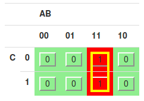

# Foundation of Computer Engineering

## Lesson 03 - Finite State Machines

---

### 1. Design a state machine that implements the following description

Let’s design a simple controller for an elevator (you will design a more complicated one for Project 1). The elevator can be at one of two floors: first or second. There is a button that controls the elevator (one input), and it has two values: up or down. Also, there are two lights in the elevator that indicate the current floor: blue for first, and yellow for second. At each time step, the controller checks the current floor and current input and changes floors and lights. Consider implementing this state machine as a Moore machine.

#### a. How many states do you need? How many outputs? Select variables to represent the state, input, and output signals.
**Ans**

From this problem:

1. There are **1** state variable of **2** possible states: $S_0$ for elevator at first floor and $S_1$ for elevator at second floor.

2. There are **2** output variables, one as indicator for blue light and another as indicator for yellow light.

Below is the variable summary for this problem.

| Variable |  Category  |                                   Description                                   |
|:--------:|:----------:|:-------------------------------------------------------------------------------:|
|     x    |    input   |                         control button  {0: down, 1: up}                        |
|     y    |    state   | state {0: S0, elevator at the first floor, 1: S1, elevator at the second floor} |
|     Y    | next state | state {0: S0, elevator at the first floor, 1: S1, elevator at the second floor} |
|    z1    |   output   |                  output 1 {0: blue light off, 1: blue light on}                 |
|    z2    |   output   |                output 2 {0: yellow light off, 1: yellow light on}               |

#### b. Draw the state diagram for your state machine.

Below is the state diagram for this problem. The diagram is created using [Finite State Machine Designer](https://www.cefns.nau.edu/~edo/Classes/CS315_WWW/Tools/fsm.html)

#### c. Draw the state table for your state machine.

Below is the state table for ths problem.

| PS | x | NS | z1 | z2 |
|:--:|:-:|:--:|:--:|:--:|
| S0 | 0 | S0 |  1 |  0 |
| S0 | 1 | S1 |  0 |  1 |
| S1 | 0 | S0 |  1 |  0 |
| S1 | 1 | S1 |  0 |  1 |

#### d. Create a truth table with multiple output columns. The inputs should be in button value and the present state value. The outputs should be the next state values and the light outputs.

Below is the truth table

| y | x | Y | z1 | z2 |
|:-:|:-:|:-:|:--:|:--:|
| 0 | 0 | 0 |  1 |  0 |
| 0 | 1 | 1 |  0 |  1 |
| 1 | 0 | 0 |  1 |  0 |
| 1 | 1 | 1 |  0 |  1 |

#### e. Draw the final combinational and sequential circuit for the state machine and output using D flip flops, logic gates, and inverters. Use K-maps to minimize the circuit size.

First is the K-map for transition table. (AB := yx)

So the excitation function is $Y = x$

Then comes to output tables. First is the K-map for z1. (AB := yx)

So the output function for z1 is $z_1 = x'$

Finally is the K-map for z2. (AB := yx)

So the output function for z1 is $z_2 = x$

To sum up:

* excitation function:

$$
Y = x
$$

* output functions:

$$
z_1 = x'
$$
$$
z_2 = x
$$

Below is the circuit implementation for this state machine

---

### 2. These questions refer to the state machine shown on slide 9 of lesson 4&5

#### a. Create a truth table for the state table shown on slide 9.

Below is the truth table

| y | x1 | x2 | Y | z |
|:-:|:--:|:--:|:-:|:-:|
| 0 |  0 |  0 | 0 | 0 |
| 0 |  0 |  1 | 0 | 1 |
| 0 |  1 |  0 | 0 | 1 |
| 0 |  1 |  1 | 1 | 0 |
| 1 |  0 |  0 | 0 | 1 |
| 1 |  0 |  1 | 1 | 0 |
| 1 |  1 |  0 | 1 | 0 |
| 1 |  1 |  1 | 1 | 1 |

#### b. Then use K-maps to minimize the size of the digital circuits for the next state values and the output.

First is the K-map for transition table. (ABC := y, x1, x2)

So the excitation function is $Y = yx_1 + yx_2 + x_1x_2$

Then is the K-map for output table. (ABC := y, x1, x2)

So the output function is $z = y^{'}x_1x_2^{'} + yx_1^{'}x_2^{'} + y^{'}x_1^{'}x_2 + yx_1x_2$

#### c. Draw the final combinational and sequential circuit for the state machine and output using D flip flops, logic gates, and inverters. Use K-maps to minimize the circuit size.

To sum up:

* excitation function:

$$
Y = yx_1 + yx_2 + x_1x_2
$$

* output function:

$$
z = y^{'}x_1x_2^{'} + yx_1^{'}x_2^{'} + y^{'}x_1^{'}x_2 + yx_1x_2
$$

Below is the circuit implementation for this state machine

---

### 3. Perform the same steps as question 2 for the state table shown on slide 19 of lesson 4&5. Use D flip flops in your solution.

#### a. Create a truth table for the state table shown on slide 9.

Below is the truth table

| y1 | y2 | x | Y1 | Y2 | z |
|:--:|:--:|:-:|:--:|:--:|:-:|
|  0 |  0 | 0 |  0 |  0 | 0 |
|  0 |  0 | 1 |  0 |  1 | 0 |
|  0 |  1 | 0 |  0 |  1 | 0 |
|  0 |  1 | 1 |  1 |  0 | 0 |
|  1 |  0 | 0 |  1 |  0 | 0 |
|  1 |  0 | 1 |  1 |  1 | 0 |
|  1 |  1 | 0 |  1 |  1 | 1 |
|  1 |  1 | 1 |  0 |  0 | 1 |

#### b. Then use K-maps to minimize the size of the digital circuits for the next state values and the output.

To begin with, let's start with the transition tables. 

First is the K-map for Y1. (ABC := y1, y2, x)

So the excitation function for Y1 is $Y_1 = y_1x^{'} + y_1y_2^{'} + y_1^{'}y_2x$

Then is the K-map for Y2. (ABC := y1, y2, x)

So the output function for Y2 is $Y_2 = y_2x^{'} + y_2^{'}x$

Next is the output table.

The K-map for z is as follows. (ABC := y1, y2, x)

So the output function for z is $z = y_1y_2$

#### c. Draw the final combinational and sequential circuit for the state machine and output using D flip flops, logic gates, and inverters. Use K-maps to minimize the circuit size.

To sum up:

* excitation functions:

$$
Y_1 = y_1x^{'} + y_1y_2^{'} + y_1^{'}y_2x
$$

$$
Y_2 = y_2x^{'} + y_2^{'}x
$$

* output functions:

$$
z = y_1y_2
$$

Below is the circuit implementation for this state machine

