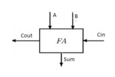
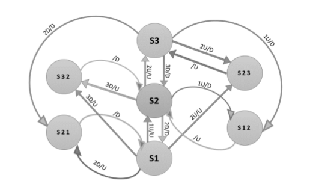

# Foundation of Computer Engineering

## Lesson 04 - Verilog

---

### 1. Consider the following chunk of Verilog code. It implements a D-type flip-flop. Answer the following questions regarding the code.

```verilog
***** Declaration part *****
**************************
always @(posedge x)
    begin
        w = z;
    end
endmodule
```

#### a. Specify the role of each signal (x, w, and z). Roles are clock, D, and Q.

**Ans** The role for each signal is as follows:

|   Signal   |  Role  |
|:----------:|:------:|
|      x     |  Clock |
|      w     |    Q   |
|      z     |    D   |

#### b. Complete the declaration of this flip-flop module. Use this chunk in a Verilog module with proper port declaration. Add all the details needed for the code to be compilable. Don't change the name of the signals.

**Ans** The complete definition for D-type flip-flop is as follows:

```verilog
module DFlipFlop(input logic x, input logic z, output logic w);
    always @(posedge x)
        begin
            w = z;
        end
endmodule
```

--- 

### 2. Provide the Verilog code for a Full Adder, shown below.



Recall that

* a full adder has 3 inputs: A, B, and Cin; 
* and 2 outputs: Sum and Cout. 

Implement this full adder using Verilog primitive gates described in the class. Name your module myFA and save it in the "FA.v". Feel free to define new intermediate signals (in the form of wires) as needed but for the ports, your module should only have those 5 mentioned ports. So, module declaration for this entity should look like the following:

```verilog
module myFA (A, B, Cin, Sum, Cout);
```

**Ans** First let's look at the boolean equation for outputs _Sum_ and _Cout_

```verilog
    Sum = A ^ B ^ Cin;
    Cout = (A & B) | (A & Cin) | (B & Cin) 
```

So the full module definition is as follows:

```verilog
module myFA(input logic A, B, Cin, output logic Sum, Cout);
    logic P, G;

    always
        begin
            P = A ^ B;
            G = A & B;

            Sum = P ^ Cin;
            Cout = G | (P & Cin);
        end
endmodule
```

---

### 3. Provide the Verilog code for a 2-bit Ripple Carry Adder.

The block diagram of a 2-bit ripple carry adder is shown below. 


In a new file, describe this structure by instantiating two copies of your myFA modules developed in problem 2. Note that, there is no Cin port in this design and you should connect the Cin port of the first full adder directly to 0. (When instantiating the full adder, in port connection, use 0 for the Cin port.) Name this new module as RippleCarryAdder. It will have 2 input ports: x and y where each of them is a 2-bit wide vector. It will also have 2 output ports: s and Co where s is a 2-bit wide vector and Co is a single bit output. So, the module declaration for this entity should look like the following:

```verilog
module RippleCarryAdder (x, y, s, Co);
```

**Ans**

The module definition is as follows. Here _myFA_ refers to the full adder defined in Question 2.

```verilog
module RippleCarryAdder(input logic [1:0] x, y, output logic [1:0] s, output logic Co);
    logic c0;

    always
        begin
        myFA lowBitAdder(x[0], y[0], 0, s[0], c0);
        myFA highBitAdder(x[1], y[1], c0, s[1], Co);
        end
endmodule
```

---

### 4. Write the module declaration and declarations of the input and output variables for the following FSM (just the module and I/O declarations and NOT the whole module). Name the module PrjFSM.



**Ans**

First, encode the inputs and outputs as follows:

|   Input   |   Encoding  |
|:---------:|:-----------:|
|     1U    |    2'b00    |
|     2U    |    2'b01    |
|     2D    |    2'b10    |
|     3D    |    2'b10    |

|  Output   |   Encoding  |
|:---------:|:-----------:|
|     U     |     1'b0    |
|     D     |     1'b1    |

```verilog
module PrjFSM(input logic [1:0] x, output logic y);
endmodule
```