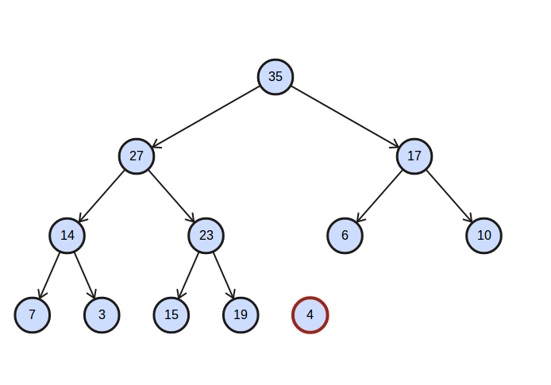
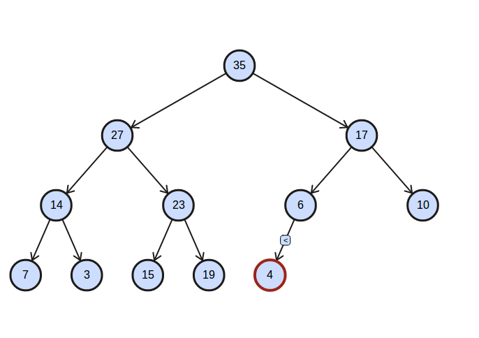
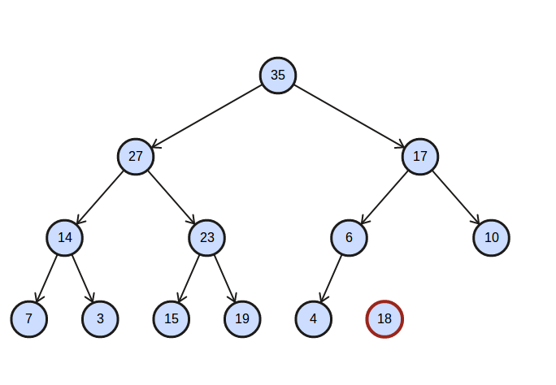
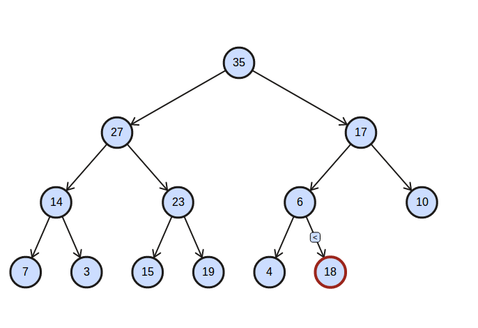
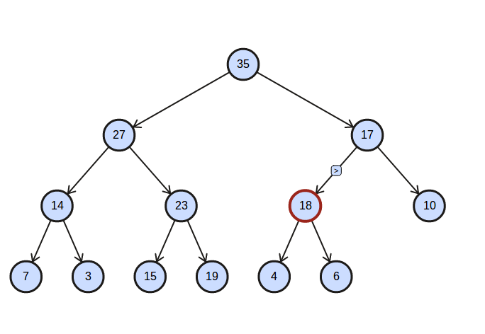
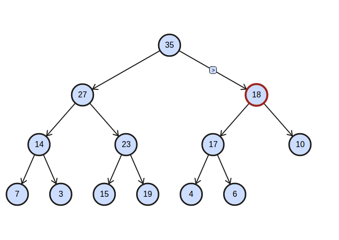
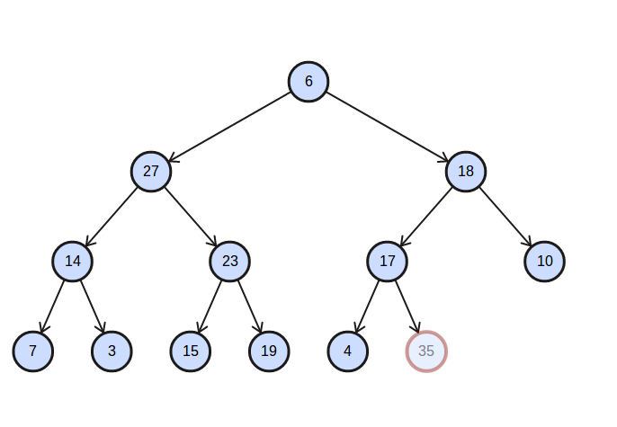
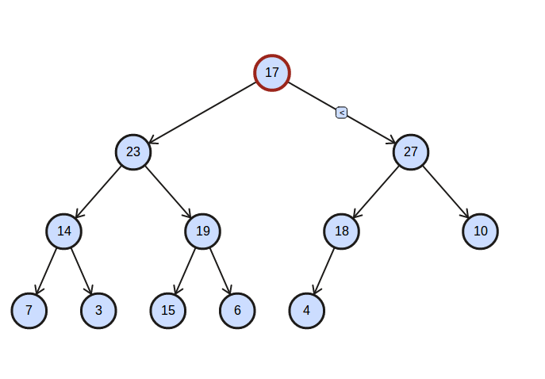
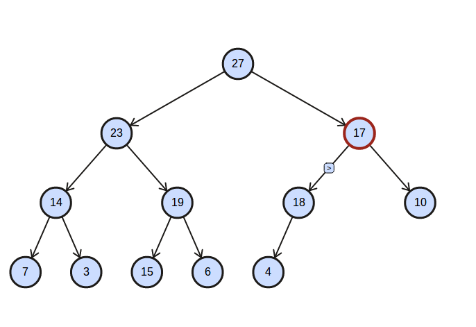
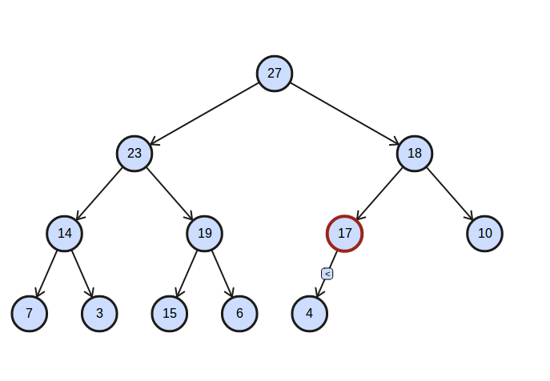

# Foundation of Computer Engineering

## Lesson 05 - C++

---

### Section 01 - Sorting

Here is the sequence to-be sorted:

    34 45 3 9 2

#### 1. Use bubble sort to sort the above list of numbers. Show all steps. 

**Ans** Below are the required steps:

Round 1
    
    ->34 45<- 3 9 2    No Swap
    34 ->45 3<- 9 2    Perform Swap    34 ->3 45<- 9 2
    34 3 ->45 9<- 2    Perform Swap    34 3 ->9 45<- 2
    34 3 9 ->45 2<-    Perform Swap    34 3 9 ->2 45<-

Round 2

    ->34 3<- 9 2 45    Perform Swap    ->3 34<- 9 2 45
    3 ->34 9<- 2 45    Perform Swap    3 ->9 34<- 2 45
    3 9 ->34 2<- 45    Perform Swap    3 9 ->2 34<- 45

Round 3 

    ->3 9<- 2 34 45    No Swap
    3 ->9 2<- 34 45    Perform Swap    3 ->2 9<- 34 45

Round 4

    ->3 2<- 9 34 45    Perform Swap    ->2 3<- 9 34 45

Done 

#### 2. Use selection sort to sort the above list of numbers. Show all steps. 

**Ans** Below are the required steps

Round 1

    ->34 45 3 9 2<-    Smallest Item 2@4, Swap With 34@0     2 ->45 3 9 34<-

Round 2

    2 ->45 3 9 34<-    Smallest Item 3@2, Swap With 45@1     2 3 ->45 9 34<-

Round 3
    
    2 3 ->45 9 34<-    Smallest Item 9@3, Swap With 45@2     2 3 9 ->45 34<-

Round 4 
    
    2 3 9 ->45 34<-    Smallest Item 34@4, Swap With 45@3    2 3 9 34 ->45<-

Done

---

### Section 02 - Stack and Queue

#### 3. Using the stack code on slides 15 and 16 of lesson 11, write a small program that uses the stack to reverse the letters in the string “question3”. Print out the string both before and after the letters are Although it would be desirable to try this using Eclipse, simply writing the program is sufficient for this question.

**Ans** Below is the required code

```c++
// Example program
#include <iostream>
#include <string>

int main()
{
    std::string input("question3");
    stack lifo;
    
    for (size_t i = 0; i < input.size(); ++i) {
        lifo.push(input.at(i));
    }
    
    std::cout << "[Input String]: " << input << std::endl;
    std::cout << "[Output String]: ";
    while (!lifo.isempty()) {
        std::cout << lifo.pop();
    }
    
    std::cout << std::endl;
}
```

And the corresponding output:

```shell
[Input String]: question3
[Output String]: 3noitseuq
```
#### 4. Using the queue code on slides 26 to 28 of lesson 11. write a small program that uses the queue to buffer the letters in the string “question4”. Print out the string both before and after the letters are entered into the Although it would be desirable to try this using Eclipse, simply writing the program is sufficient for this question.

**Ans** Below is the required code

```c++
// Example program
#include <iostream>
#include <string>

int main()
{
    std::string input("question4");
    queue fifo;
    
    for (size_t i = 0; i < input.size(); ++i) {
        fifo.push(input.at(i));
    }
    
    std::cout << "[Input String]: " << input << std::endl;
    std::cout << "[Output String]: ";
    while (!fifo.empty()) {
        std::cout << fifo.pop();
    }
    
    std::cout << std::endl;
}
```

And the corresponding output:

```shell
[Input String]: question4
[Output String]: question4
```

---

### Section 03 - Object

#### 5. In your own words, what is a linked list? In C++, what is an object? How are linked lists and objects related?

**Linked List**: A separate collection of items which doesn't need the continuous memory of array/vector. 

**Object**: In C++, class is an user-defined data type with its own data members and member functions. Object is an instantiation of a certain class.

**Relation between the Two**: Inside a linked list, each item is a node object with one item object and a pointer to next node.

---

### Section 04 - Recursion and Iteration

#### 6. Write iterative and recursive C++ programs that determine the factorial of an input number n. For example, the factorial of 4 is 4*3*2*1 = 24. What is the complexity in big O notation for your programs? Although it would be desirable to try this using Eclipse, simply writing the programs is sufficient for this question.

**Ans**

First is the iterative version:

```c++
long factorial_iterative(int n){
    long result = 1;
    
    for (int i = 2; i <= n; ++i) {
        result *= i;
    }
    
    return result;
}
```

Then is the recursive version:

```c++
long factorial_recursive(int n) {
    if (n > 1) {
        return n * factorial_recursive(n - 1);
    }
    
    return 1;
}
```

Regarding the complexity analysis:

1. Both have time complexity of O(N), however, the iterative version hass smaller constant factor than recursive one.
2. On space complexity, the iterative one has O(1) but recursive one has O(N). The recursive one will have the largest stack size when it reaches its leaf call.

---

### Section 05 - Heap

#### 7. Insert the following numbers (4, 18) into the heap shown at the top of slide 18 of lesson 12. Show all steps.

**Ans** First are the steps for insertion of 4:





Then are the steps for insertion of 18:









#### 8. After completing question 7, delete the value 35 from the heap. Show all steps. 

**Ans** Below are the steps for deletion of 35







