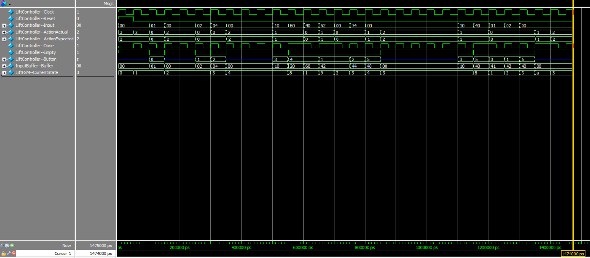
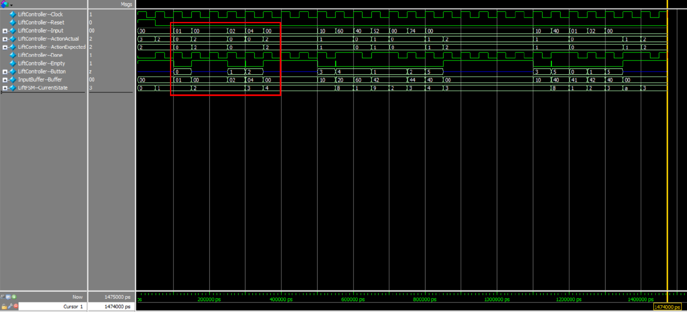
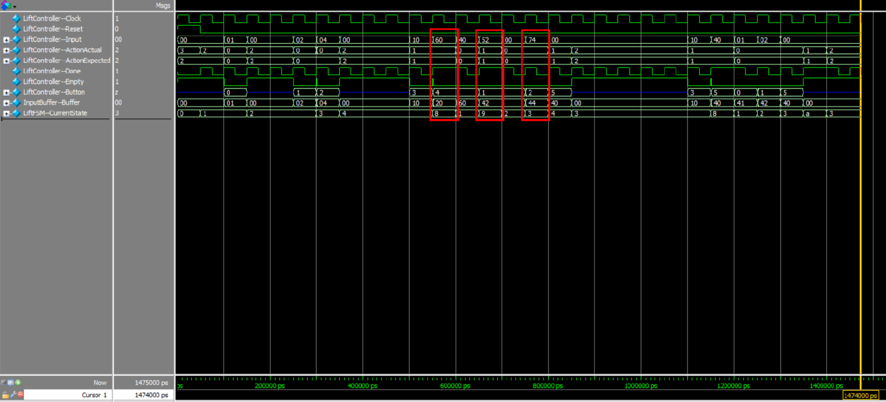
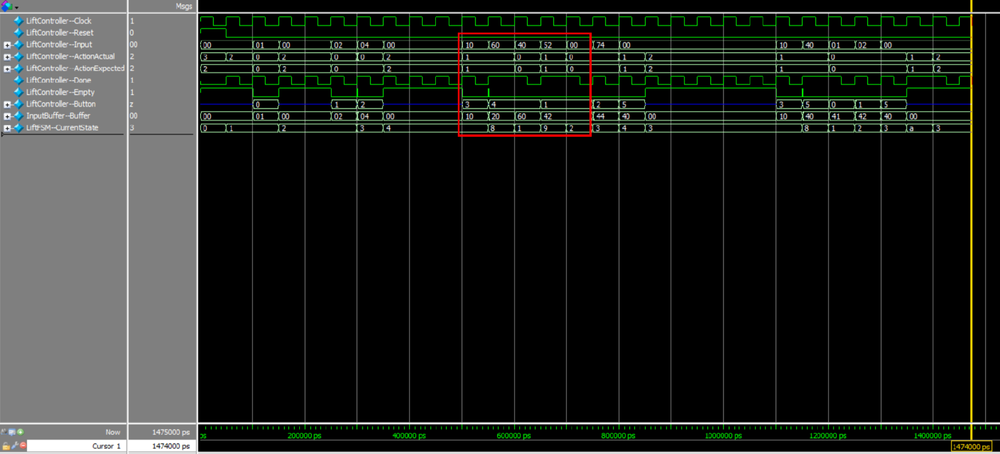
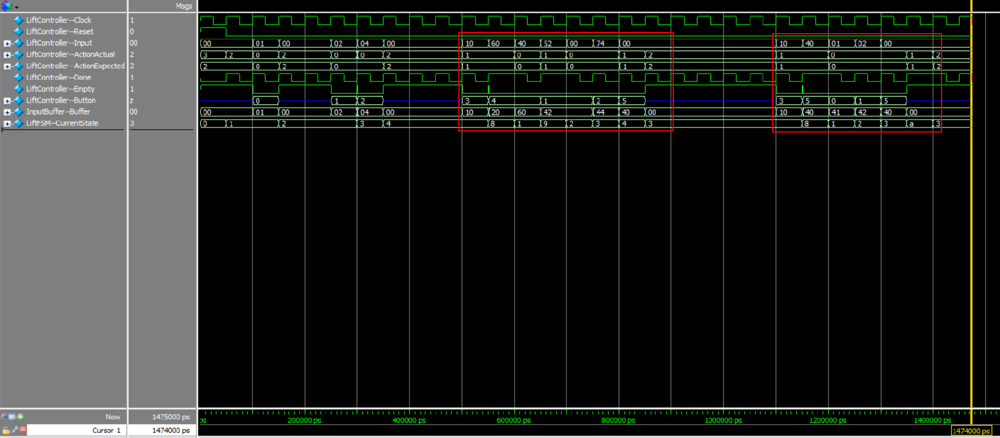

# Foundation of Computer Engineering

## Project 01 -- FSM for Lift Control

---

### Problem Statement

In this project an elevator operation will be simulated in Verilog. 

There are **4 floors** between which the elevator can move and there are **buttons on each floor, all external to the elevator**. 

**A button press implies certain action or action sequence to be taken**, which are described in detail in the following sections. **The elevator system can be modeled as a Finite State Machine that undergo state transitions and produces outputs depending on the inputs provided**. Design the Finite state machine and describe its behavior either by using a state diagram or a table. Implement the system according to the specifications mentioned below, in Verilog and submit the code as well as the waveforms along with a detailed write up describing the same.

#### a. Input Description

There are 6 inputs to the system in addition to a clock signal. The clock signal is used for synchronization purposes. The button 1U is in the first floor, 2U & 2D in the second floor, 3U & 3D in the third floor, and 4D in the 4 th floor. A button press and its implication is tabulated below.

| INPUT (Button Press) |                        IMPLICATION                        |
|:--------------------:|:---------------------------------------------------------:|
|          1U          | Person in the first floor wants to go to the second floor |
|          2U          | Person in the second floor wants to go to the third floor |
|          3U          | Person in the third floor wants to go to the fourth floor |
|          4D          | Person in the fourth floor wants to go to the third floor |
|          3D          | Person in the third floor wants to go to the second floor |
|          2D          | Person in the second floor wants to go to the first floor |

#### b. Output Description

There are 3 outputs indicating the action that is to be taken and is tabulated below.

| OUTPUT (Elevator Action) |                IMPLICATION               |
|:------------------------:|:----------------------------------------:|
|            Up            |  elevator moves in the upward direction  |
|           Down           | elevator moves in the downward direction |
|           Stay           |     elevator stays in the same floor     |

#### c. System Behavior

The elevator can be in any of the 4 floors; Floor 1, Floor 2, Floor 3, or Floor 4. At each clock cycle, depending on whether a button is pressed or not, certain action has to be taken which is tabulated below

| Current Position of Elevator | Input |                  Action Sequence to be Taken                 |
|:----------------------------:|:-----:|:------------------------------------------------------------:|
|           1st floor          |   1U  |              Move the elevator to the 2nd floor              |
|                              |   2U  |    Move the elevator to the 2nd floor and then to the 3rd    |
|                              |   2D  |    Move the elevator to the 2nd floor and then to the 1st    |
|                              |   3U  |    Move the elevator to the 3rd floor and then to the 4th    |
|                              |   3D  |    Move the elevator to the 3rd floor and then to the 2nd    |
|                              |   4D  |    Move the elevator to the 4th floor and then to the 3rd    |
|           2nd floor          |   1U  |    Move the elevator to the 1st floor and then to the 2nd    |
|                              |   2U  |              Move the elevator to the 3rd floor              |
|                              |   2D  |              Move the elevator to the 1st floor              |
|                              |   3U  |    Move the elevator to the 3rd floor and then to the 4th    |
|                              |   3D  |    Move the elevator to the 3rd floor and then to the 2nd    |
|                              |   4D  |    Move the elevator to the 4th floor and then to the 3rd    |
|           3rd floor          |   1U  |    Move the elevator to the 1st floor and then to the 2nd    |
|                              |   2U  |    Move the elevator to the 2nd floor and then to the 3rd    |
|                              |   2D  |    Move the elevator to the 2nd floor and then to the 1st    |
|                              |   3U  |              Move the elevator to the 4th floor              |
|                              |   3D  |              Move the elevator to the 2nd floor              |
|                              |   4D  |    Move the elevator to the 4th floor and then to the 3rd    |
|           4th floor          |   1U  |    Move the elevator to the 1st floor and then to the 2nd    |
|                              |   2U  |    Move the elevator to the 2nd floor and then to the 3rd    |
|                              |   2D  |    Move the elevator to the 2nd floor and then to the 1st    |
|                              |   3U  |    Move the elevator to the 3rd floor and then to the 4th    |
|                              |   3D  | Move the elevator to the 3rd floor and then to the 2nd floor |
|                              |   4D  |            Move the elevator to the the 3rd floor            |

#### d. Multiple Input Processing: Buffer

In order to account for the cases when multiple buttons are pressed at the same time or one after the other, we need to have a mechanism to keep track of the input requests made (a buffer) and means to prioritize them. In order to simplify the code, consider the following to be the order of priority: 1U, 2U, 3U, 2D, 3D, 4D.

For instance, consider the following requests to be made one after the other: 2U, 3D and 1U. The order of processing them would be as follows: 1U, 2U and 3D irrespective of the current position of the elevator.

While designing the mechanism to keep track of the input requests made, note that the order of arrival of requests and the current position of the elevator is irrelevant in deciding the order of execution. This is because our system is supposed to follow the order of priority mentioned above. Also ignore an input request if the same request is already present in the buffer.

--- 

### Overview

#### Solution Architecture

The architecture of the designed solution is as follows. It consists of two modules, InputBuffer and LiftFSM.

The nodes of the designed controller are as follows:

* Input Pins
    * Clock
    * Reset
    * Input: 6-bit bus, using one-hot encoding for each input:
        * 1U: 000001
        * 2U: 000010
        * 3U: 000100
        * 2D: 001000
        * 3D: 010000
        * 4D: 100000
* Ouput Pins
    * Action: 2-bit bus, using binary encoding for each action: 
        * Up: 00
        * Down: 01
        * Stay: 10.
* Internal Nodes
    * Done: Driven by LiftFSM, indicates the current command has been processed and is ready for next.
    * Empty: Driven by InputBuffer, indicates the current buffer is empty.
    * Button: 3-bit bus, using binary encoding for each button:
        * 1U: 000
        * 2U: 001
        * 3U: 010
        * 2D: 011
        * 3D: 100
        * 4D: 101

---

### LiftFSM Design
 
#### State Identification

Since the input and output of the required controller have already been well-defined, here we focus on the very last step before we can start the actual FSM design: the state identification.

Follow the suggestion given in the solution hint, we start the identification process by converting the system behavior description to a symbolic one:

| Current Position of Elevator | Input |                  Action Sequence to be Taken                 | Symbolic Description |
|:----------------------------:|:-----:|:------------------------------------------------------------:|:--------------------:|
|           1st floor          |   1U  |              Move the elevator to the 2nd floor              |        S1->S2        |
|                              |   2U  |    Move the elevator to the 2nd floor and then to the 3rd    |      S1->S23->S3     |
|                              |   2D  |    Move the elevator to the 2nd floor and then to the 1st    |      S1->S21->S1     |
|                              |   3U  |    Move the elevator to the 3rd floor and then to the 4th    |      S1->S34->S4     |
|                              |   3D  |    Move the elevator to the 3rd floor and then to the 2nd    |      S1->S32->S2     |
|                              |   4D  |    Move the elevator to the 4th floor and then to the 3rd    |      S1->S43->S3     |
|           2nd floor          |   1U  |    Move the elevator to the 1st floor and then to the 2nd    |      S2->S12->S2     |
|                              |   2U  |              Move the elevator to the 3rd floor              |        S2->S3        |
|                              |   2D  |              Move the elevator to the 1st floor              |        S2->S1        |
|                              |   3U  |    Move the elevator to the 3rd floor and then to the 4th    |      S2->S34->S4     |
|                              |   3D  |    Move the elevator to the 3rd floor and then to the 2nd    |      S2->S32->S2     |
|                              |   4D  |    Move the elevator to the 4th floor and then to the 3rd    |      S2->S43->S3     |
|           3rd floor          |   1U  |    Move the elevator to the 1st floor and then to the 2nd    |      S3->S12->S2     |
|                              |   2U  |    Move the elevator to the 2nd floor and then to the 3rd    |      S3->S23->S3     |
|                              |   2D  |    Move the elevator to the 2nd floor and then to the 1st    |      S3->S21->S1     |
|                              |   3U  |              Move the elevator to the 4th floor              |        S3->S4        |
|                              |   3D  |              Move the elevator to the 2nd floor              |        S3->S2        |
|                              |   4D  |    Move the elevator to the 4th floor and then to the 3rd    |      S3->S43->S3     |
|           4th floor          |   1U  |    Move the elevator to the 1st floor and then to the 2nd    |      S4->S12->S2     |
|                              |   2U  |    Move the elevator to the 2nd floor and then to the 3rd    |      S4->S23->S3     |
|                              |   2D  |    Move the elevator to the 2nd floor and then to the 1st    |      S4->S21->S1     |
|                              |   3U  |    Move the elevator to the 3rd floor and then to the 4th    |      S4->S34->S4     |
|                              |   3D  | Move the elevator to the 3rd floor and then to the 2nd floor |      S4->S32->S2     |
|                              |   4D  |            Move the elevator to the the 3rd floor            |        S4->S3        |

So the full state definition is as follows:

| State |    Type   |                         Description                         |
|:-----:|:---------:|:-----------------------------------------------------------:|
|   S1  |    Idle   |                 the elevator is at 1st floor                |
|   S2  |    Idle   |                 the elevator is at 2nd floor                |
|   S3  |    Idle   |                 the elevator is at 3rd floor                |
|   S4  |    Idle   |                 the elevator is at 4th floor                |
|  S12  |    Busy   | the elevator is moving to the 1st floor and then to the 2nd |
|  S23  |    Busy   | the elevator is moving to the 2nd floor and then to the 3rd |
|  S21  |    Busy   | the elevator is moving to the 2nd floor and then to the 1st |
|  S34  |    Busy   | the elevator is moving to the 3rd floor and then to the 4th |
|  S32  |    Busy   | the elevator is moving to the 3rd floor and then to the 2nd |
|  S43  |    Busy   | the elevator is moving to the 4th floor and then to the 3rd |

#### Definition

With the above notation, we can convert the system behavior description into the following state diagram and state table.

First is the corresponding **state diagram**. (Sorry for the complexity, please try to match the state transition arc with the INPUT/OUTPUT tag at the middle of it :P):


And the corresponding, easier-to-read **state table**:

| PresentState | Input | NextState | Output |
|:------------:|:-----:|:---------:|:------:|
|      S1      |   1U  |     S2    |    U   |
|      S1      |   2U  |    S23    |    U   |
|      S1      |   3U  |    S34    |    U   |
|      S1      |   2D  |    S21    |    U   |
|      S1      |   3D  |    S32    |    U   |
|      S1      |   4D  |    S43    |    U   |
|      S2      |   1U  |    S12    |    D   |
|      S2      |   2U  |     S3    |    U   |
|      S2      |   3U  |    S34    |    U   |
|      S2      |   2D  |     S1    |    D   |
|      S2      |   3D  |    S32    |    U   |
|      S2      |   4D  |    S43    |    U   |
|      S3      |   1U  |    S12    |    D   |
|      S3      |   2U  |    S23    |    D   |
|      S3      |   3U  |     S4    |    U   |
|      S3      |   2D  |    S21    |    D   |
|      S3      |   3D  |     S2    |    D   |
|      S3      |   4D  |    S43    |    U   |
|      S4      |   1U  |    S12    |    D   |
|      S4      |   2U  |    S23    |    D   |
|      S4      |   3U  |    S34    |    D   |
|      S4      |   2D  |    S21    |    D   |
|      S4      |   3D  |    S32    |    D   |
|      S4      |   4D  |    S43    |    D   |

#### Done: Definition InputBuffer Synchronization Signal

Here the definition of **Done** signal is modified to fit the event-driven pattern of InputBuffer. The signal doesn't mean it is in Idle state anymore. Rather, it stands for "The LiftFSM has finished the processing of current command, please render next at the forthcoming positive edge."

In order to correctly fetch next command, the Done is defined as follows. Next command will be fetched at the end of system initialization and each Idle state.

```verilog
	// output decoder:
	assign Done = (
	(
		(CurrentState == STATE_Idle_on_1st) ||
		(CurrentState == STATE_Idle_on_2nd) ||
		(CurrentState == STATE_Idle_on_3rd) ||
		(CurrentState == STATE_Idle_on_4th)
	) && Clock) || (
		(CurrentState == STATE_Busy_1st_to_2nd) ||
		(CurrentState == STATE_Busy_2nd_to_3rd) ||
		(CurrentState == STATE_Busy_3rd_to_4th) ||
		(CurrentState == STATE_Busy_2nd_to_1st) ||
		(CurrentState == STATE_Busy_3rd_to_2nd) ||
		(CurrentState == STATE_Busy_4th_to_3rd)
	);
```

#### Implementation

Below is the Verilog implementation of the above FSM. The full source code can be found inside 

```verilog
// ---------
// Lift FSM
// ---------
module LiftFSM(
	input wire Clock,
	input wire Reset,
	input wire Empty,
	input wire [2:0] Button,
	output wire Done,
	output reg [1:0] Action
);
	// declare button control encoding:
	localparam Button_1U = 3'd0,
		Button_2U = 3'd1,
		Button_3U = 3'd2,
		Button_2D = 3'd3,
		Button_3D = 3'd4,
		Button_4D = 3'd5,
		Button_6_Placeholder = 3'd6,
		Button_7_Placeholder = 3'd7;

	// declare action encoding:
	localparam Action_Up = 2'd0,
		Action_Down = 2'd1,
		Action_Stay = 2'd2,
		Action_Reset = 2'd3;
		
	// declare state encoding:
	localparam STATE_Initial = 4'd0,
		STATE_Idle_on_1st = 4'd1,
		STATE_Idle_on_2nd = 4'd2, 
		STATE_Idle_on_3rd = 4'd3, 
		STATE_Idle_on_4th = 4'd4, 
		STATE_Busy_1st_to_2nd = 4'd5, 
		STATE_Busy_2nd_to_3rd = 4'd6, 
		STATE_Busy_3rd_to_4th = 4'd7, 
		STATE_Busy_2nd_to_1st = 4'd8, 
		STATE_Busy_3rd_to_2nd = 4'd9, 
		STATE_Busy_4th_to_3rd = 4'd10, 
		STATE_11_Placeholder = 4'd11, 
		STATE_12_Placeholder = 4'd12, 
		STATE_13_Placeholder = 4'd13, 
		STATE_14_Placeholder = 4'd14, 
		STATE_15_Placeholder = 4'd15;	
		
	// declare state variable:
	reg [3:0] CurrentState;
	reg [3:0] NextState;
	
	// next state decoder:
	always @(CurrentState or Button) begin
		// default: stay at current state
		NextState = CurrentState;
		
		// ---------
		// state transition
		// ---------
		case (CurrentState)
			// 0. initial:
			STATE_Initial: begin
				NextState = STATE_Idle_on_1st;
			end
			// 1. on the 1st floor:
			STATE_Idle_on_1st: begin
				case (Button)
					Button_1U: begin
						NextState = STATE_Idle_on_2nd;
					end
					Button_2U: begin
						NextState = STATE_Busy_2nd_to_3rd;
					end
					Button_3U: begin
						NextState = STATE_Busy_3rd_to_4th;
					end
					Button_2D: begin
						NextState = STATE_Busy_2nd_to_1st;
					end
					Button_3D: begin
						NextState = STATE_Busy_3rd_to_2nd;
					end
					Button_4D: begin
						NextState = STATE_Busy_4th_to_3rd;
					end
					Button_6_Placeholder: begin
					end
					Button_7_Placeholder: begin
					end
					default: begin
					end
				endcase
			end
			// 2. on the 2nd floor:
			STATE_Idle_on_2nd: begin
				case (Button)
					Button_1U: begin
						NextState = STATE_Busy_1st_to_2nd;
					end
					Button_2U: begin
						NextState = STATE_Idle_on_3rd;
					end
					Button_3U: begin
						NextState = STATE_Busy_3rd_to_4th;
					end
					Button_2D: begin
						NextState = STATE_Idle_on_1st;
					end
					Button_3D: begin
						NextState = STATE_Busy_3rd_to_2nd;
					end
					Button_4D: begin
						NextState = STATE_Busy_4th_to_3rd;
					end
					Button_6_Placeholder: begin
					end
					Button_7_Placeholder: begin
					end
					default: begin
					end
				endcase				
			end
			// 3. on the 3rd floor:
			STATE_Idle_on_3rd: begin
				case (Button)
					Button_1U: begin
						NextState = STATE_Busy_1st_to_2nd;
					end
					Button_2U: begin
						NextState = STATE_Busy_2nd_to_3rd;
					end
					Button_3U: begin
						NextState = STATE_Idle_on_4th;
					end
					Button_2D: begin
						NextState = STATE_Busy_2nd_to_1st;
					end
					Button_3D: begin
						NextState = STATE_Idle_on_2nd;
					end
					Button_4D: begin
						NextState = STATE_Busy_4th_to_3rd;
					end		
					Button_6_Placeholder: begin
					end
					Button_7_Placeholder: begin
					end
					default: begin
					end
				endcase		
			end
			// 4. on the 4th floor:
			STATE_Idle_on_4th: begin
				case (Button)
					Button_1U: begin
						NextState = STATE_Busy_1st_to_2nd;
					end
					Button_2U: begin
						NextState = STATE_Busy_2nd_to_3rd;
					end
					Button_3U: begin
						NextState = STATE_Busy_3rd_to_4th;
					end
					Button_2D: begin
						NextState = STATE_Busy_2nd_to_1st;
					end
					Button_3D: begin
						NextState = STATE_Busy_3rd_to_2nd;
					end
					Button_4D: begin
						NextState = STATE_Idle_on_3rd;
					end	
					Button_6_Placeholder: begin
					end
					Button_7_Placeholder: begin
					end
					default: begin
					end
				endcase			
			end
			// ---------
			//	transient states: to terminal 
			// ---------
			STATE_Busy_1st_to_2nd: begin
				NextState = STATE_Idle_on_2nd;
			end
			STATE_Busy_2nd_to_3rd: begin
				NextState = STATE_Idle_on_3rd;
			end
			STATE_Busy_3rd_to_4th: begin
				NextState = STATE_Idle_on_4th;
			end
			STATE_Busy_2nd_to_1st: begin
				NextState = STATE_Idle_on_1st;
			end
			STATE_Busy_3rd_to_2nd: begin
				NextState = STATE_Idle_on_2nd;
			end
			STATE_Busy_4th_to_3rd: begin
				NextState = STATE_Idle_on_3rd;
			end
			// ---------
			// place-holder states: lock to indicate error
			// ---------
			STATE_11_Placeholder: begin
				NextState = STATE_Initial;
			end
			STATE_12_Placeholder: begin
				NextState = STATE_Initial;
			end
			STATE_13_Placeholder: begin
				NextState = STATE_Initial;
			end
			STATE_14_Placeholder: begin
				NextState = STATE_Initial;
			end
			STATE_15_Placeholder: begin
				NextState = STATE_Initial;
			end
			default: begin
				NextState = STATE_Initial;
			end
		endcase
	end
	
	// next-state memory:
	always @(posedge Clock) begin
		if (Reset) begin 
			CurrentState <= STATE_Initial;
		end else begin
			CurrentState <= NextState;
		end
	end
	
	// output decoder:
	assign Done = (
	(
		(CurrentState == STATE_Idle_on_1st) ||
		(CurrentState == STATE_Idle_on_2nd) ||
		(CurrentState == STATE_Idle_on_3rd) ||
		(CurrentState == STATE_Idle_on_4th)
	) && Clock) || (
		(CurrentState == STATE_Busy_1st_to_2nd) ||
		(CurrentState == STATE_Busy_2nd_to_3rd) ||
		(CurrentState == STATE_Busy_3rd_to_4th) ||
		(CurrentState == STATE_Busy_2nd_to_1st) ||
		(CurrentState == STATE_Busy_3rd_to_2nd) ||
		(CurrentState == STATE_Busy_4th_to_3rd)
	);
	
	always @(CurrentState or Button) begin
		case (CurrentState)
			// 0. initial:
			STATE_Initial: begin
				Action = Action_Reset;
			end
			// 1. on the 1st floor:
			STATE_Idle_on_1st: begin
				case (Button)
					Button_1U, Button_2U, Button_3U, Button_2D, Button_3D, Button_4D: begin
						Action = Action_Up;
					end
					Button_6_Placeholder, Button_7_Placeholder: begin
						Action = Action_Stay;
					end
					default: begin
						Action = Action_Stay;
					end
				endcase
			end
			// 2. on the 2nd floor:
			STATE_Idle_on_2nd: begin
				case (Button)
					Button_1U, Button_2D: begin
						Action = Action_Down;
					end
					Button_2U, Button_3U, Button_3D, Button_4D: begin
						Action = Action_Up;
					end
					Button_6_Placeholder, Button_7_Placeholder: begin
						Action = Action_Stay;
					end
					default: begin
						Action = Action_Stay;
					end
				endcase				
			end
			// 3. on the 3rd floor:
			STATE_Idle_on_3rd: begin
				case (Button)
					Button_1U, Button_2U, Button_2D, Button_3D: begin
						Action = Action_Down;
					end
					Button_3U, Button_4D: begin
						Action = Action_Up;
					end
					Button_6_Placeholder, Button_7_Placeholder: begin
						Action = Action_Stay;
					end
					default: begin
						Action = Action_Stay;
					end
				endcase		
			end
			// 4. on the 4th floor:
			STATE_Idle_on_4th: begin
				case (Button)
					Button_1U, Button_2U, Button_3U, Button_2D, Button_3D, Button_4D: begin
						Action = Action_Down;
					end	
					Button_6_Placeholder, Button_7_Placeholder: begin
						Action = Action_Stay;
					end
					default: begin
						Action = Action_Stay;
					end
				endcase			
			end
			// ---------
			//	transient states: to terminal 
			// ---------
			STATE_Busy_1st_to_2nd, STATE_Busy_2nd_to_3rd, STATE_Busy_3rd_to_4th: begin
				Action = Action_Up;
			end
			STATE_Busy_2nd_to_1st, STATE_Busy_3rd_to_2nd, STATE_Busy_4th_to_3rd: begin
				Action = Action_Down;
			end
			// ---------
			// place-holder states: stay
			// ---------
			STATE_11_Placeholder, STATE_12_Placeholder, STATE_13_Placeholder, STATE_14_Placeholder, STATE_15_Placeholder: begin
				Action = Action_Reset;
			end
			// ---------
			// default:
			// ---------
			default: begin
				Action = Action_Reset;
			end
		endcase
	end
endmodule
```

---

### InputBuffer Design

#### Priority Buffer Design

The priority buffer is a 6-bit memory driven by external input and internal Done signal generated by LiftFSM. Here the set and reset of a specific bit are used to represent the presence and absence of a specific input. This properly models the input processing logic that when a certain input has already been present, it should simply be ignored. Besides, the priority is assigned that the lower the bit, the higher the priority: from MSB to LSB, the bit represents 4D, 3D, 2D, 3U, 2U, 1U respectively. Since the rightmost bit of a memory can be efficiently identified using simple bit operations(this will be discussed in later subsections), this arrangement can greatly simplify the buffer management.

Besides the actual storage Buffer, there is also a state variable CurrentCommand representing the current button command for LiftFSM. This state variable is used for output decoding and will be updated when current button should be preempted or a new Done signal is received and the LiftFSM is ready for next command. The update command is shown in the code snippet below. It can efficiently fetch next command of highest priority with simple bit operation.

```verilog
    CurrentCommand = Buffer & ((~Buffer) + 1);
```

#### Input and Done Event Processing

First, the buffer and current command should be updated when there is an input change. For each input, first its rightmost bit will be isolated. After that the effective command will be enqueued and current command will be updated. This preprocessing can handle multiple concurrent input and keep only the one of highest priority. Besides, it can also handle the case when an input of higher priority preempts current one because the command will be updated immediately after buffer update.

```verilog
	always @(
		Input
	) begin			
		// input enqueue: only the button of highest priority
		Buffer = Buffer | (Input & ((~Input) + 1));
		CurrentCommand = Buffer & ((~Buffer) + 1);
	end
```

Finally, the buffer will also be updated when a new Done signal is received. Here the positive edge should be used otherwise the whole buffer will be drained immediately when the Done is set. After receiving the signal, the executed command should be first removed from the buffer. Then next command should be fetched and used to generate the button command.

```verilog
	always @(
		posedge Done
	) begin
		// buffer dequeue:
		if (!Empty) begin
			Buffer = Buffer & ~CurrentCommand;
			CurrentCommand = Buffer & ((~Buffer) + 1);
		end
	end
```

#### Implementation

Below is the Verilog implementation of the above InputBuffer. The full source code can be found inside 

```verilog
// ---------
// Input Buffer
// ---------
module InputBuffer(
	input wire Reset,
	input wire Done,
	input wire [5:0] Input,
	output reg Empty,
	output reg [2:0] Button
);	
	// declare highest priority button encoding:
	localparam Input_1U = 6'b000001,
		Input_2U = 6'b000010,
		Input_3U = 6'b000100,
		Input_2D = 6'b001000,
		Input_3D = 6'b010000,
		Input_4D = 6'b100000;
	
	// declare output encoding:
	localparam Button_1U = 3'd0,
		Button_2U = 3'd1,
		Button_3U = 3'd2,
		Button_2D = 3'd3,
		Button_3D = 3'd4,
		Button_4D = 3'd5;
	
	// declare buffer:
	reg [5:0] Buffer;
	reg [5:0] CurrentCommand;
	
	// ---------
	// reset
	// ---------
	always @(Reset) begin
		if (Reset) begin
			Buffer <= 6'b0;
			CurrentCommand <= 6'b0;
		end
	end
	
	// ---------
	// input priority buffer
	// ---------
	always @(
		Input
	) begin			
		// input enqueue: only the button of highest priority
		Buffer = Buffer | (Input & ((~Input) + 1));
		CurrentCommand = Buffer & ((~Buffer) + 1);
	end
	
	// ---------
	//	current command update
	// ---------	
	always @(
		posedge Done
	) begin
		// buffer dequeue:
		if (!Empty) begin
			Buffer = Buffer & ~CurrentCommand;
			CurrentCommand = Buffer & ((~Buffer) + 1);
		end
	end
	
	// ---------
	// output decoder
	// ---------
	always @(Buffer) begin
		Empty = (Buffer == 6'b000000);
	end
	
	always @(CurrentCommand) begin
		if (CurrentCommand) begin
			case (CurrentCommand)
				Input_1U: begin
					Button <= Button_1U;
				end
				Input_2U: begin
					Button <= Button_2U;
				end
				Input_3U: begin
					Button <= Button_3U;
				end
				Input_2D: begin
					Button <= Button_2D;
				end
				Input_3D: begin
					Button <= Button_3D;
				end
				Input_4D: begin
					Button <= Button_4D;
				end
				default: begin
					Button <= 3'bz;
				end
			endcase
		end else begin
			Button <= 3'bz;
		end
	end
endmodule
```

---

### LiftController Implementation

Below is the lift controller implementation using the above two modules.

```verilog
// ---------
// Lift Controller
// ---------
module LiftController(
	input wire Clock,
	input wire Reset,
	input wire [5:0] Input,
	output wire [1:0] Action
);
	// declare internal control nodes:
	wire Done, Empty;
	// declare internal data nodes:
	wire [2:0] Button;
	
	// component 1: input buffer:
	InputBuffer input_buffer(
		.Reset(Reset),
		.Done(Done),
		.Input(Input),
		.Empty(Empty),
		.Button(Button)
	);
	
	// component 2: lift FSM
	LiftFSM lift_fsm(
		.Clock(Clock), 
		.Reset(Reset),
		.Empty(Empty),
		.Button(Button), 
		.Done(Done),
		.Action(Action)		
	);
endmodule
```

### Testbench

In this project three test benches are designed: two unit tests for InputBuffer and LiftFSM respectively and one integration test for LiftController. All test benches just set up the framework, read test vectors from the selected data file then compare the actual output with the expected one. The over test bench and test vectors for LiftController are shown below. For each test case, the corresponding time diagram is highlighted using red rectangle in the attached picture.

```verilog
module TestbenchLiftController;
	// declare input signals:
	reg Clock, Reset;
	reg [5:0] Input;
	// declare actual output signals:
	wire [1:0] Action;
	// declare expected output signals:
	reg [1:0] Action_Expected;
	// declare testvectors:
	integer vector_id, num_error;
	reg [7:0] testvectors[127:0];
	
	// instantiate the lift FSM:
	LiftController dut(
		.Clock(Clock), 
		.Reset(Reset),
		.Input(Input),
		.Action(Action)
	);
	
	// generate clock
	always begin
		Clock <= 1; #25;
		Clock <= 0; #25;
	end
	
	// initialize:
	initial begin
		// load test vectors:
		$readmemb("C:/intelFPGA/18.0/workspace/01-lift-controller/lift_controller_tv.txt", testvectors);
		vector_id = 0; num_error = 0;
		
		// reset device:
		Reset = 1;
		#50;
		
		// turn reset off:
		Reset = 0;
	end

	// apply input at posive edge:
	always @(posedge Clock) begin
		#1 {Input, Action_Expected} = testvectors[vector_id];
	end

	// check output at negative edge:
	always @(negedge Clock) begin
		if (!Reset) begin // skip during reset
			// update error statistics:
			if ((Action !== Action_Expected)) begin
				$display("Testcase: %d", vector_id + 1);
				$display("\tErrror: Input = %b", Input);
				$display("\tOutput: Action = %b(%b expected)", 
					Action, Action_Expected
				);
				num_error = num_error + 1;
			end
			
			// next test vector:
			vector_id = vector_id + 1;
			
			// terminates when all testvectors are fetched:
			if (testvectors[vector_id] === 8'bx) begin
				$display("%d tests completed with %d errors", vector_id, num_error);
				$finish;
			end
		end
	end
endmodule
```

|  Input | ActionExpected |
|:------:|:--------------:|
| 000000 |       10       |
| 000001 |       00       |
| 000000 |       10       |
| 000000 |       10       |
| 000010 |       00       |
| 000100 |       00       |
| 000000 |       10       |
| 000000 |       10       |
| 000000 |       10       |
| 001000 |       01       |
| 110000 |       01       |
| 100000 |       00       |
| 101010 |       01       |
| 000000 |       00       |
| 111100 |       00       |
| 000000 |       01       |
| 000000 |       10       |
| 000000 |       10       |
| 000000 |       10       |
| 000000 |       10       |
| 000000 |       10       |
| 001000 |       01       |
| 100000 |       01       |
| 000001 |       00       |
| 000010 |       00       |
| 000000 |       00       |
| 000000 |       01       |
| 000000 |       10       |
| 000000 |       10       |



#### Case One: Command One-by-One

In this case control command is executed one-by-one. At any time the buffer contains at most one command. Under the command sequence 1U-2U-3U, the controller correctly transits through the state space along S1-S2-S3. 



#### Case Two: Simultaneous Inputs
In this case simultaneous inputs are processed. The controller only takes the one of highest priority as is specified in requirement document. 



#### Case Three: Multiple Inputs. 
In this case multiple inputs are applied. During the execution of 2D, 3D is received. The controller caches 3D and executes it after finishing 2D.



#### Case Four: Multiple Inputs with Preemption
In this case commands of different priority are cached together. In the first example, command 4D is properly preempted by 2U and 3U and is only executed after 3U. In the second example, command 4D is preempted by 1U and 2U and is only executed after 2U.



---

### Conclusion

In this project a lift controller is designed and implemented. The controller will keep the input of highest priority when simultaneous inputs are applied. When given multiple inputs, the controller will cache and process them one by one. in the order of descending priority. The controller is implemented in Verilog. Testbench results show that it meets the design requirements.
