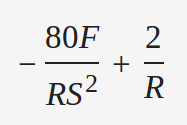
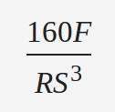
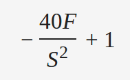
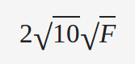

# Computer Networks

## Lesson 01 - Introduction

---

### 1. Consider an application that transmits data at a steady rate (for example, the sender generates an N-bit unit of data every k time units, where k is small and fixed). Also, when such an application starts, it will continue running for a relatively long period of time. Answer the following questions, briefly justifying your answer.

#### a. Would a packet-switched network or a circuit-switched network be more appropriate for this application? Why?

**Ans:** In this situation a packet-switched network should be used for the following reasons. 

Since the application will run for a very long period of time, and the data will only be generated every k time units, if circuit-switched network is used and a dedicated circuit is assigned to its traffic, the circuit utilization would only be 1/k, which would be a great waste of networking resources. Hence a packet-switched network should be preferred.

#### b. Suppose that a packet-switched network is used and the only traffic in this network comes from such applications as described above. Furthermore, assume that the sum of the application data rates is less than the capacities of each and every link. Is some form of congestion control needed? Why?

**Ans:** No. In this situation the traffic density is guaranteed to be lower than 1 for each and every link at any given time. Thus no queue will be formed during the transmission process and no congestion control is needed.

---

### 2. This elementary problem begins to explore propagation delay and transmission delay, two central concepts in data networking. Consider two hosts, A and B, connected by a single link of rate R bps. Suppose that the two hosts are separated by m meters, and suppose the propagation speed along the link is s meters/sec. Host A is to send a packet of size L bits to Host B

#### a. Express the propagation delay, d_prop , in terms of m and s

**Ans:** d_prop = m / s

#### b. Determine the transmission time of the packet, d trans , in terms of L and R.

**Ans:** d_trans = L / R

#### c. Ignoring processing and queuing delays, obtain an expression for the end-to-end delay.

**Ans:** 

By definition, we have: 

d_end-to-end = d_processing + d_queuing + d_prop + d_trans

Since both d_processing and d_queuing are ignorable, we have

d_end-to-end = d_prop + d_trans = (m / s) + (L / R)

#### d. Suppose Host A begins to transmit the packet at time t=0 . At time t = d_trans , where is the last bit of the packet?

**Ans:** The last bit has just left the sender, host A and started its journey on link to host B.

#### e. Suppose d_prop is greater than d_trans . At time t = dtrans , where is the first bit of the packet?

**Ans:** At this time the first bit is still on the link from host A to host B.

#### f. Suppose d_prop is less than d_trans . At time t = dtrans , where is the first bit of the packet?

**Ans:** At this time the first bit has already arrived at host B and been stored.

#### g. Suppose s = 2.5⋅108 , L = 120 bits , and R = 56 kbps. Find the distance m so that d prop equals d_trans .

**Ans:** When d_prop equals d_trans, we have (m / s) = (L / R)

So m = s * L / R = 535.71km

--- 

### 3. Suppose you would like to urgently deliver 40 terabytes data from Boston to Los Angeles. You have available a 100 Mbps dedicated link for data transfer. Would you prefer to transmit the data via this link or instead use FedEx over-night delivery? Explain

**Ans:**

The time needed to transmit this data using dedicated link is: 

```python
# data size in bits
L = 40 * (1024 ** 4) * 8
# transmission rate in bps
R = 100 * (10 ** 6)
# total seconds in one day
D = 24 * 60 * 60

# total time needed through dedicated link:
T = (L / R) / D
```

Using the above Python we attained that the time needed for dedicated link transmission is around 40 days.

So we'd better choose data logistics services like FedEx over-night delivery in this case.

---

### 4. Suppose two hosts, A and B, are separated by 20,000 kilometers and are connected by a direct link of R=2 Mbps. Suppose the propagation speed over the link is 2.5⋅108 meters/sec.

#### a. Calculate the bandwidth-delay product, R⋅dprop.

**Ans:**

Since:

d_prop = m / s

So R * d_prop = R * m / s = (2 * (10 ** 6)) * (20000 * (10 ** 3)) / (2.5 * (10 ** 8)) = 0.16 Mbit = 0.02MB

#### b. Consider sending a file of 800,000 bits from Host A to Host B. Suppose the file is sent continuously as one large message. What is the maximum number of bits that will be in the link at any given time?

**Ans:**

Since d_trans = L / R = (8 * (10 ** 5)) / (2 * (10 ** 6)) = 0.4 second

while d_prop = m / s = (20000 * (10 ** 3)) / (2.5 * (10 ** 8)) = 0.08 second

d_trans > d_prop

So the maximum number of bits that will be in the link is R * d_prop = 0.16Mbit = 0.02MB

#### c. Provide an interpretation of the bandwidth-delay product.

**Ans:**

The maximum number of bits that could be in the link at any given time. The maximum could only be reached when d_prop <= d_trans

#### d. What is the width (in meters) of a bit in the link? Is it longer than a ­football field?

**Ans:**

The bit width should be m / (R * d_prop) = (20000 * (10 ** 3)) / (0.16 * (10 ** 6)) = 125 meter

This is longer than standard football field of length 109.1 meter.

#### e. Derive a general expression for the width of a bit in terms of the propagation speed s, the transmission rate R, and the length of the link m.

**Ans:**

The expression should be m / (R * d_prop) = m / (R * (m / s)) = s / R

---

### 5. Consider sending a large file of F bits from Host A to Host B. There are three links (and two switches) between A and B, and the links are uncongested (that is, no queuing delays). Host A segments the file into segments of S bits each and adds 80 bits of header to each segment, forming packets of L = 80 + S bits. Each link has a transmission rate of R bps. Find the value of S that minimizes the delay of moving the file from Host A to Host B. Disregard propagation delay.

**Ans:**

The total transmission time should be:

```python
# set up ScyPy session:
from sympy import *
# define symbols:
F, S, R = symbols('F S R')
# total transmission time:
T = (F / S + 2) * (80 + S) / R
```

Since the first and second order derivatives are:

```python
dT = simplify(diff(T, S))
```



```python
d2T = simplify(diff(dT, S))
```



So the total transmission time will have the minimum when its first order derivative, which is equivalent to the following expression, is 0:



Solve the above equation, we have the optimal S as:



