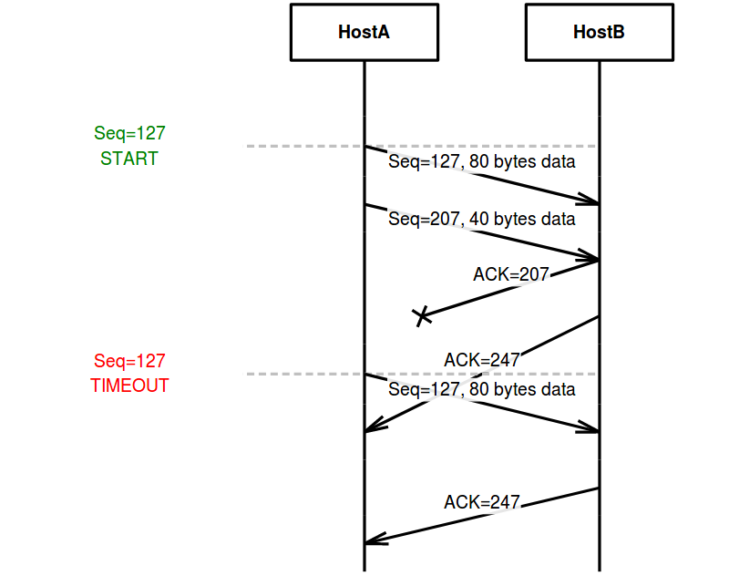

# Computer Networks

## Lesson 03 - Transport Layer

---

### P26. Consider transferring an enormous file of L bytes from Host A to Host B. Assume an MSS of 536 bytes.

#### a. What is the maximum value of L such that TCP sequence numbers are not exhausted? Recall that the TCP sequence number field has 4 bytes.
**Ans** 

Since 4 bytes are equal to 32 bits, the maximum number of TCP segments will be $2^{32} = {4,294,967,296}$.

So the maximum value of L will be $2^{32} * 536$ Bytes = $2^{2} * 536 * 2^{30}$ Bytes = $2144$ GB = $2.1$ TB. 

#### b. For the L you obtain in (a), find how long it takes to transmit the file. Assume that a total of 66 bytes of transport, network, and data-link header are added to each segment before the resulting packet is sent out over a 155 Mbps link. Ignore flow control and congestion control so A can pump out the segments back to back and continuously.
**Ans**

Taking all the headers(from both transport, network and data-link layers) into consideration, each frame will be of $536 + 66 = 602 Bytes$.

So **the total transmission size** will be $N_{frame} * Size_{frame}$ = $2^{32} * 602$ Bytes = $2^{32} * 602 * 8$ bits.

Consequently **the total transmission time** will be $(N_frame * Size_{frame}) / R = (2^{32} * 602 * 8) / (155 * 10^{6}) = 133, 448$ seconds = $37$ hours.

---

### P27. Host A and B are communicating over a TCP connection, and Host B has already received from A all bytes up through byte 126. Suppose Host A then sends two segments to Host B back-to-back. The first and second segments contain 80 and 40 bytes of data, respectively. In the first segment, the sequence number is 127, the source port number is 302, and the destination port number is 80. Host B sends an acknowledgment whenever it receives a segment from Host A.

#### a. In the second segment sent from Host A to B, what are the sequence number, source port number, and destination port number?
**Ans**

The sequence number will be $127 + 80 = 207$. source port number will be **302**, destination port number will be **80**.

#### b. If the first segment arrives before the second segment, in the acknowledgment of the first arriving segment, what is the acknowledgment number, the source port number, and the destination port number?
**Ans**

Since the segment arrives in order, the acknowledgment number will be the next sequence number **207**, the source port number will be **80**, and the destination port number will be **302**.

#### c. If the second segment arrives before the first segment, in the acknowledgment of the first arriving segment, what is the acknowledgment number?
**Ans**

Since in this case a gap is detected, the acknowledgment number will be the next in-order sequence number **127**.

#### d. Suppose the two segments sent by A arrive in order at B. The first acknowledgment is lost and the second acknowledgment arrives after the first timeout interval. Draw a timing diagram, showing these segments and all other segments and acknowledgments sent. (Assume there is no additional packet loss.) For each segment in your figure, provide the sequence number and the number of bytes of data; for each acknowledgment that you add, provide the acknowledgment number.
**Ans**

The following time sequence diagram is drawn using the online tool [mscgen](https://mscgen.js.org/).



Below is the required script to generate the above sequence diagram.

```text
msc{    
    width="800";
    
    notes[label=" ", linecolor="white"], HostA, HostB;

    notes box notes [label="Seq=127\nSTART", textcolor="green", linecolor="white", textbgcolor="white"],
    notes .. HostB [linecolor="silver"],
    HostA =>> HostB [ label = "Seq=127, 80 bytes data", arcskip="1" ];
    HostA =>> HostB [ label = "Seq=207, 40 bytes data", arcskip="1" ];
    
    HostA x- HostB [ label = "ACK=207", arcskip="1" ];
    HostA <<= HostB [ label = "ACK=247", arcskip="2" ];
    
    notes box notes [label="Seq=127\nTIMEOUT", textcolor="red", linecolor="white", textbgcolor="white"],
    notes .. HostB [linecolor="silver"],
    HostA =>> HostB [ label = "Seq=127, 80 bytes data", arcskip="1" ];
    |||;
    
    HostA <<= HostB [ label = "ACK=247", arcskip="1" ];
    |||;
}
```

---

### P46. Consider that only a single TCP (Reno) connection uses one 10Mbps link which does not buffer any data. Suppose that this link is the only congested link between the sending and receiving hosts. Assume that the TCP sender has a huge file to send to the receiver, and the receiver’s receive buffer is much larger than the congestion window. We also make the following assumptions: each TCP segment size is 1,500 bytes; the two-way propagation delay of this connection is 150 msec; and this TCP connection is always in congestion avoidance phase, that is, ignore slow start.

#### a. What is the maximum window size (in segments) that this TCP connection can achieve?
**Ans**

The maximum congestion window size (in segments) $C_{max}$ will be reached when traffic intensity, $\dfrac{\frac{C_{max}*L}{RTT}}{R}$, is 1.

Since packet size L equals TCP segment size $1,500 * 8$ bits, the round-trip time eqauls $150$ msec and path transmission rate equals the only congested link bandwidth $10$ Mbps, the maximum congestion window size (in segments) will be:

$$
C_{max} = \frac{RTT * R}{L} = \frac{150*10^{-3} * 10*10^{+6}}{1500 * 8} = 125
$$

So the maximum window size (in segments) will be **125**

#### b. What is the average window size (in segments) and average throughput (in bps) of this TCP connection?
**Ans**

Since through the lifetime of this TCP connection, the window size periodically grows linearly to maximum size, then drop back to 1 when timeout happens and repeat linear growth after the drop, the **average window size** will be 

$$
C_{avg} = \frac{C_{max} + C_{min}}{2} = \frac{125 + 1}{2} = 63
$$

The average throughput (in bps) will be 

$$
\lambda_{avg} = \frac{C_{avg}*L}{RTT} = \frac{63 * 1500 * 8}{150 * 10^{-3}} = 5,040,000 
$$

So the average, i.e., effective throughput will be **5.04Mbps**, which is approximately **half of the total available path bandwidth**.

#### c. How long would it take for this TCP connection to reach its maximum window again after recovering from a packet loss?
**Ans**

The window size (in segments) grows by 1 after each RTT. So the total time it takes to grow to max size again after a packet loss will be

$$
T = (C_{max} - C_{min}) * RTT = (125 - 1) * 150 * 10^{-3} = 18.6
$$

So it takes **18.6** seconds to operate at max window size again after a packet loss.

---

### P48. Repeat Problem 46, but replacing the 10 Mbps link with a 10 Gbps link. Note that in your answer to part c, you will realize that it takes a very long time for the congestion window size to reach its maximum window size after recovering from a packet loss. Sketch a solution to solve this problem.
**Ans**

When 10Gbps path link is used:

1. maximum window size in segments:

$$
C_{max} = \frac{RTT * R}{L} = \frac{150*10^{-3} * 10*10^{+6}}{1500 * 8} = 125,000
$$

2. average window size in segments:

$$
C_{avg} = \frac{C_{max} + C_{min}}{2} = \frac{125,000 + 1}{2} = 62500.5
$$

3. average throughput:

$$
\lambda_{avg} = \frac{C_{avg}*L}{RTT} = \frac{62500.5 * 1500 * 8}{150 * 10^{-3}} = 5,000,040,000
$$

4. time it takes to recover to max size after a packet loss, in seconds:

$$
T = (C_{max} - C_{min}) * RTT = (125,000 - 1) * 150 * 10^{-3} = 18749.85
$$

From the above calculation we can see it takes approximate 18750 seconds, which is around 5.2 hours, to restore max window size. This will be extremely inefficient. 

A possible solution is as follows:

Slow start should be used. It could help to reduce the time needed for growing from default size to half max size down to

$$
log_2(62500) * RTT = 15.931 * 150 * 10^{-3} = 2.390
$$

Compared with the congestion avoidance only scheme

$$
62500 * RTT = 15.931 * 150 * 10^{-3} = 9375
$$

$9375 - 2.390 = 9372.61$ seconds can be saved

