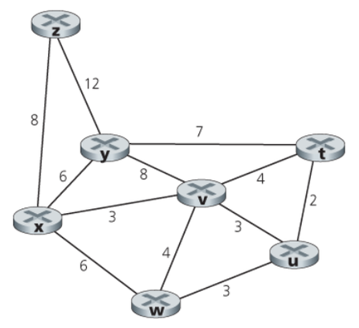
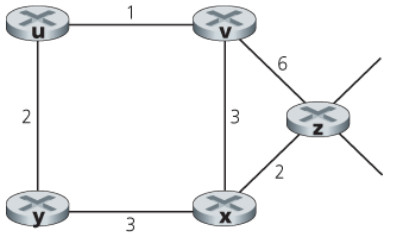
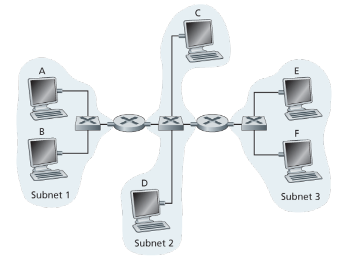

# Computer Networks

## Lesson 05 - Internet Layer -- Control Plane

---

### P3. Consider the following network. With the indicated link costs, use Dijkstra’s shortest-path algorithm to compute the shortest path from x to all network nodes. Show how the algorithm works by computing a table similar to Table 5.1.



**Ans**

First comes the Dijkstra's algorithm for all-node shortest path in Python.

```python
#!/usr/bin/python
import heapq
from collections import namedtuple

class PQ(object):
    def __init__(self):
        self._pq = []

    def get_elements(self):
        return self._pq

    def push(self, key, value):
        heapq.heappush(self._pq, (key, value))
    
    def pop(self):
        (key, value) = heapq.heappop(self._pq)

        return (key, value)

Hop = namedtuple('Hop', ['current', 'previous'])

def get_link_state_routing(network, init):
    """
    use link-state algorithm to compute the forward table for selected router n
    """
    from sets import Set

    # total number of routers:
    N = len(network)

    # states:
    explored = Set()
    frontier = PQ()
    routes = {}
    table = []

    # init:
    init_hop = Hop(current = init, previous = init)
    frontier.push(0, init_hop)

    while len(explored) < N:
        # explore:
        cost, hop = frontier.pop()

        # filter: 
        current = hop.current
        if current in explored:
            continue

        # update:
        explored.add(current)
        routes[current] = {
            'cost': cost,
            'parent': hop.previous
        }

        # expand frontier:
        for next_hop, link_cost in network[current].iteritems():
            if not next_hop in explored:
                frontier.push(
                    cost + link_cost, 
                    Hop(current = next_hop, previous = current)
                )

        # get current state
        status = {}
        for router in network.keys():
            if router in explored:
                status[router] = (routes[router]['cost'], routes[router]['parent'])
            else:
                status[router] = next(
                    ((r[0], r[1].previous) for r in frontier.get_elements() if r[1].current == router), 
                    (None, None)
                )
        table.append(
            ",".join(sorted(explored)) + "--" + "\t".join(str((router, status[router])) for router in sorted(network.keys()))
        ) 

    # format table:
    table = "\n".join(table)
    # format routes:
    for terminal, state in routes.iteritems():
        route = [terminal]

        parent = state['parent']
        while routes[parent]['parent'] != parent:
            route.append(parent)
            parent = routes[parent]['parent']
        route.append(parent)

    return table, routes

if __name__ == '__main__':
    # network topology definition:
    network = {
        't': {
            'u': 2, 'v': 4, 'y': 7
        },
        'u': {
            't': 2, 'v': 3, 'w': 3
        },
        'v': {
            't': 4, 'u': 3, 'w': 4, 'x': 3, 'y': 8
        },
        'w': {
            'u': 3, 'v': 4, 'x': 6
        },
        'x': {
            'v': 3, 'w': 6, 'y': 6, 'z': 8
        },
        'y': {
            't': 7, 'v': 8, 'x': 6, 'z': 12
        },
        'z': {
            'x': 8, 'y': 12
        }
    }

    table, route = get_link_state_routing(network, 'x')

    print table
```

Execute the above script, we can get the following table for link-state algorithm state evolvement.

| step |       N'      | D(t),p(t) | D(u),p(u) | D(v),p(v) | D(w),p(w) | D(x),p(x) | D(y),p(y) | D(z),p(z) |
|:----:|:-------------:|:---------:|:---------:|:---------:|:---------:|:---------:|:---------:|:---------:|
|   0  |       x       |  Inf,None |  Inf,None |   3, 'x'  |   6, 'x'  |   0, 'x'  |   6, 'x'  |   8, 'x'  |
|   1  |      v,x      |   7, 'v'  |   6, 'v'  |           |   6, 'x'  |           |   6, 'x'  |           |
|   2  |     u,v,x     |   7, 'v'  |           |   3, 'x'  |   6, 'x'  |           |           |           |
|   3  |    u,v,w,x    |           |   6, 'v'  |   3, 'x'  |           |   0, 'x'  |           |           |
|   4  |   u,v,w,x,y   |   7, 'v'  |           |   3, 'x'  |           |   0, 'x'  |           |   8, 'x'  |
|   5  |  t,u,v,w,x,y  |           |   6, 'v'  |   3, 'x'  |           |           |   6, 'x'  |   8, 'x'  |
|   6  | t,u,v,w,x,y,z |           |           |           |           |   0, 'x'  |   6, 'x'  |           |

---

### P5. Consider the network shown below, and assume that each node initially knows the costs to each of its neighbors. Consider the distance-vector algorithm and show the distance table entries at node z



**Ans**

First is the implementation of distance vector algorithms for distributed route computing:

```Python
#!/usr/bin/python
def get_distance_vector_routes(network):
    # set up session:
    import copy
    from pprint import pprint

    # init:
    dv_prev = copy.deepcopy(network)
    for router in dv_prev.keys():
        dv_prev[router][router] = 0
        dv_prev[router] = {
            k: (v, k) for k,v in dv_prev[router].iteritems()
        }
    dv_next = copy.deepcopy(dv_prev)
    should_broadcast = {}
    for router in dv_prev.keys():
        should_broadcast[router] = True

    while any(should_broadcast.values()):
        # compute:
        for router in network.keys():
            for neighbor in network[router].keys():
                for dest, route in dv_prev[neighbor].iteritems():
                    (cost, _) = route
                    # propose new route cost:
                    new_route = (network[router][neighbor] + cost, neighbor)
                    # keep only min:
                    if dest in dv_next[router]:
                        dv_next[router][dest] = min(dv_next[router][dest], new_route, key = lambda t: t[0])
                    else:
                        dv_next[router][dest] = new_route
            # should broadcast current route table:
            should_broadcast[router] = (dv_next[router] != dv_prev[router])
        
        # save current state:
        dv_prev = copy.deepcopy(dv_next)

        # display:
        pprint(dv_next)
        pprint(should_broadcast)

        print ""

if __name__ == '__main__':
    # network topology definition:
    network = {
        'u': {
            'v': 1, 'y': 2
        },
        'v': {
            'u': 1, 'x': 3, 'z': 6
        },
        'x': {
            'v': 3, 'y': 3, 'z': 2
        },
        'y': {
            'u': 2, 'x': 3
        },
        'z': {
            'v': 6, 'x': 2
        }
    }

    get_distance_vector_routes(network)
```

Execute the above script, we can get the following table for route table evolvement in format *destination: (cost, forward interface)*:

| Step |                                   u                                   |                                   v                                   |                                    x                                   |                                   y                                   |                                   z                                   |
|:----:|:---------------------------------------------------------------------:|:---------------------------------------------------------------------:|:----------------------------------------------------------------------:|:---------------------------------------------------------------------:|:---------------------------------------------------------------------:|
|   1  | 'u': (0, 'u') 'v': (1, 'v') 'x': (4, 'v') 'y': (2, 'y') 'z': (7, 'v') | 'u': (1, 'u') 'v': (0, 'v') 'x': (3, 'x') 'y': (3, 'u') 'z': (5, 'x') | 'u': (4, 'v') 'v': (3, 'v') 'x': (0, 'x')  'y': (3, 'y') 'z': (2, 'z') | 'u': (2, 'u') 'v': (3, 'u') 'x': (3, 'x') 'y': (0, 'y') 'z': (5, 'x') | 'u': (7, 'v') 'v': (5, 'x') 'x': (2, 'x') 'y': (5, 'x') 'z': (0, 'z') |
|   2  | 'u': (0, 'u') 'v': (1, 'v') 'x': (4, 'v') 'y': (2, 'y') 'z': (6, 'v') | 'u': (1, 'u') 'v': (0, 'v') 'x': (3, 'x') 'y': (3, 'u') 'z': (5, 'x') |  'u': (4, 'v') 'v': (3, 'v') 'x': (0, 'x') 'y': (3, 'y') 'z': (2, 'z') | 'u': (2, 'u') 'v': (3, 'u') 'x': (3, 'x') 'y': (0, 'y') 'z': (5, 'x') | 'u': (6, 'x') 'v': (5, 'x') 'x': (2, 'x') 'y': (5, 'x') 'z': (0, 'z') |
|   3  | 'u': (0, 'u') 'v': (1, 'v') 'x': (4, 'v') 'y': (2, 'y') 'z': (6, 'v') |                                                                       |                                                                        |                                                                       |                                                                       |                                                                                                    |                                                                                                     |                                                                                                     |                                                                                                      |

---

### P14. Consider three LANs interconnected by two routers, as shown in Figure 6.33



#### a. Assign IP addresses to all of the interfaces. For Subnet 1 use addresses of the form 192.168.1.xxx; for Subnet 2 uses addresses of the form 192.168.2.xxx; and for Subnet 3 use addresses of the form 192.168.3.xxx.

**Ans**

Below are the assigned IP addresses for subnet 1:

|   Device   |  IP Address |
|:----------:|:-----------:|
|   Host A   | 192.168.1.1 |
|   Host B   | 192.168.1.2 |
| Router 1-2 | 192.168.1.3 |

Subnet 2:

|   Device   |  IP Address |
|:----------:|:-----------:|
|   Host C   | 192.168.2.1 |
|   Host D   | 192.168.2.2 |
| Router 1-2 | 192.168.2.3 |
| Router 2-3 | 192.168.2.4 |

Subnet 3:

|   Device   |  IP Address |
|:----------:|:-----------:|
|   Host E   | 192.168.3.1 |
|   Host F   | 192.168.3.2 |
| Router 2-3 | 192.168.3.3 |

#### b. Assign MAC addresses to all of the adapters.

**Ans**

Below are the assigned MAC addresses for subnet 1:

|   Device   |    MAC Address    |
|:----------:|:-----------------:|
|   Host A   | 18:DB:F2:20:D1:91 |
|   Host B   | 18:DB:F2:20:D1:92 |
| Router 1-2 | 18:DB:F2:20:D1:93 |

Subnet 2:

|   Device   |    MAC Address    |
|:----------:|:-----------------:|
|   Host C   | 18:DB:F2:20:D2:91 |
|   Host D   | 18:DB:F2:20:D2:92 |
| Router 1-2 | 18:DB:F2:20:D2:93 |
| Router 2-3 | 18:DB:F2:20:D2:94 |

Subnet 3:

|   Device   |    MAC Address    |
|:----------:|:-----------------:|
|   Host E   | 18:DB:F2:20:D3:91 |
|   Host F   | 18:DB:F2:20:D3:92 |
| Router 2-3 | 18:DB:F2:20:D3:93 |

#### c. Consider sending an IP datagram from Host E to Host B. Suppose all of the ARP tables are up to date. Enumerate all the steps, as done for the single-router example in Section 6.4.1

**Ans**

Below are the steps for the above packet transmission:

1. Host E builds the following packet
    * source IP address: 192.168.3.1
    * destination IP address: 192.168.1.2
    * source MAC address: 18:DB:F2:20:D3:91
    * destination MAC address(from ARP table in Host E): 18:DB:F2:20:D3:93, interface in subnet 3 of Router 2-3
2. Router 2-3 forwards the packet to its interface in subnet 2
3. Router 2-3 builds the following packet
    * source IP address: 192.168.2.4
    * destination IP address: 192.168.1.2
    * source MAC address: 18:DB:F2:20:D2:94
    * destination MAC address(from ARP table in Router 2-3): 18:DB:F2:20:D2:93, interface in subnet 2 of Router 1-2
4. Router 1-2 forwards the packet to its interface in subnet 1
4. Router 1-2 builds the following packet
    * source IP address: 192.168.1.3
    * destination IP address: 192.168.1.2
    * source MAC address: 18:DB:F2:20:D1:93
    * destination MAC address(from ARP table in Router 1-2): 18:DB:F2:20:D1:92, Host B in subnet 1

#### d. Repeat (c), now assuming that the ARP table in the sending host is empty (and the other tables are up to date)

**Ans**

In order to set up the ARP table in sending host E, the following steps should be performed before executing steps in section c:

1. Host E builds an ARP query packet
    * source IP address: 192.168.3.1
    * destination IP address: 192.168.1.2
    * source MAC address: 18:DB:F2:20:D3:91
    * destination MAC address: FF:FF:FF:FF:FF:FF
2. Router 2-3  receives the ARP query packet, finds it is reachable through other interfaces and sends the following ARP response packet
    * IP address: 192.168.1.2
    * MAC address: 18:DB:F2:20:D3:93
3. After receiving the packet, host E sets up the correct entry in its ARP table.

After the above ARP MAC address resolution process, host E can use the procedure in section c to correctly transmit the packet.

---

### P17. Recall that with the CSMA/CD protocol, the adapter waits K⋅512 bit times after a collision, where K is drawn randomly. For K=100 , how long does the adapter wait until returning to Step 2 for a 10 Mbps broadcast channel? For a 100 Mbps broadcast channel?

**Ans**

The wait time for link with R = 10Mbps is

$$
T_{backoff} = \frac{K * UnitTransTime}{R} = \frac{100*512}{10*10^{6}} = 5.12ms
$$

The time for link with R = 100Mbps is

$$
T_{backoff} = \frac{K * UnitTransTime}{R} = \frac{100*512}{100*10^{6}} = 512us
$$

---

### P18. Suppose nodes A and B are on the same 10 Mbps broadcast channel, and the propagation delay between the two nodes is 325 bit times. Suppose CSMA/CD and Ethernet packets are used for this broadcast channel. Suppose node A begins transmitting a frame and, before it finishes, node B begins transmitting a frame. Can A finish transmitting before it detects that B has transmitted? Why or why not? If the answer is yes, then A incorrectly believes that its frame was successfully transmitted without a collision. Hint: Suppose at time t=0 bits, A begins transmitting a frame. In the worst case, A transmits a minimum-sized frame of 512+64 bit times. So A would finish transmitting the frame at t=512+64 bit times. Thus, the answer is no, if B’s signal reaches A before bit time t=512+64 bits. In the worst case, when does B’s signal reach A?

**Ans**

No. A's transmitting size must be at least R * 2 * propagation delay 2 * 325 equals 650 bits.

The worst-case situation would be: Node B starts transmission when the first bit from node A just arrives node B.

In this case, in order for node A to realize that there is a collision, it must wait long enough to receive the corrupted signal from node B. This will be another propagation delay. 

So the minimum transmitting time for node A would be two times propagation delay thus the minimum frame size should be 650 bits.